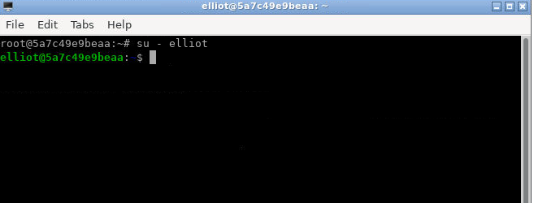
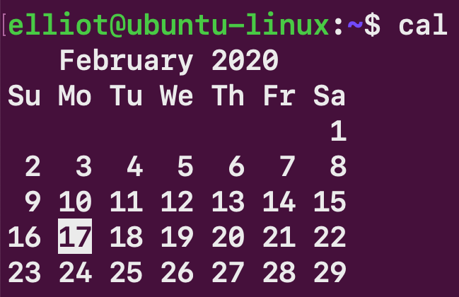
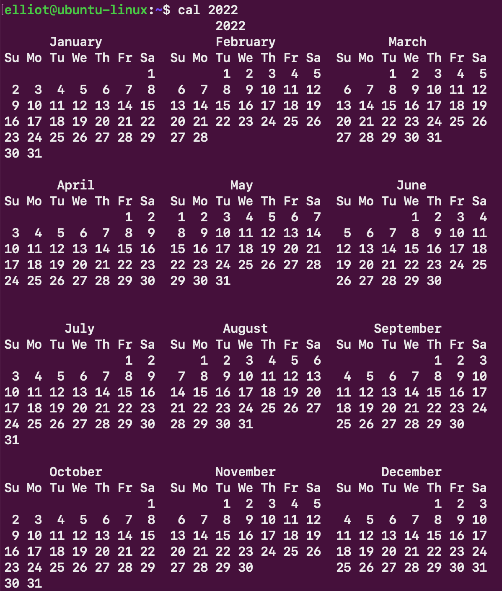
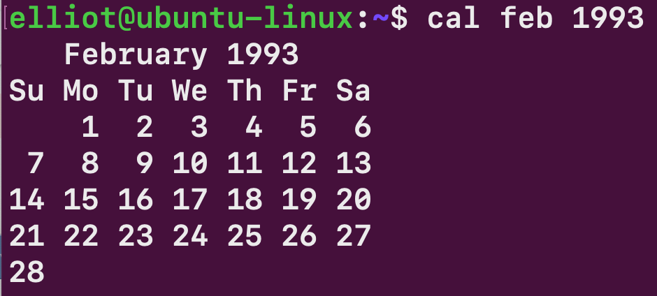
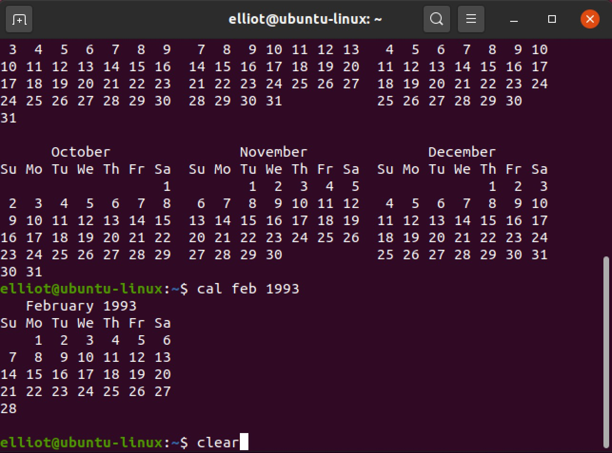
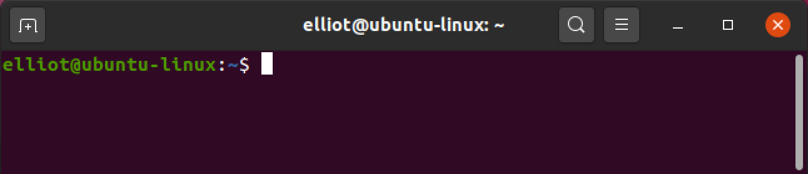
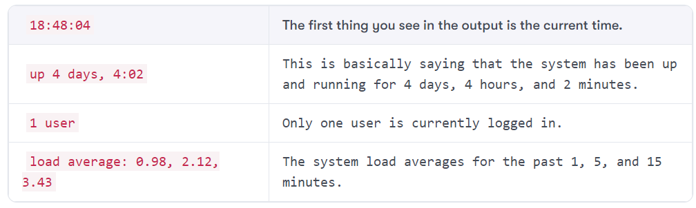

Lab: System Administration Overview
-----------------------------------

To access the Linux **Command Line Interface**, you need to open the
[Terminal Emulator], which is often referred to as the
**Terminal** for simplicity.


Let\'s walk through an example
to understand and tie everything together. Go ahead and open the
Terminal by clicking on the Dash and then search [Terminal]. When
the Terminal opens, you will see a new window, as shown in the following
screenshot. Run following command in the terminal to switch to `elliot` user:

`su - elliot`




It looks kind of similar to the [Command Prompt] on
Microsoft Windows. Alright, now type [date] on your Terminal and
then hit *Enter*:

``` 
elliot©ubuntu-linux:-$ date 
Tue Feb 17 16:39:13 CST 2023
```

Now let\'s discuss what happened, [date] is a Linux command that
prints the current date and time, right after you hit *Enter*, the Shell
(which is working behind the scenes) then executed the command
[date] and displayed the output on your Terminal.

You shouldn\'t be confused between the **Terminal** and the **Shell**.
The Terminal is the window you see on your screen where you can type in
your commands while the Shell is responsible for executing the commands.
That\'s it, nothing more and nothing less.

You should also know that if you type any gibberish, you will get a
**command not found** error as shown in the following example:

``` 
elliot©ubuntu-linux:-$ blabla 
blabla: command not found
```


A few simple commands
=====================


Congratulations on learning your first Linux command ([date]). Now
let\'s keep learning more!

One would usually display the calendar after displaying that date,
right? To display the calendar of the current month, you can run the
[cal] command:





You can also display the calendar of the whole year, for example, to get
the full 2022 calendar, you can run:





You can also specify a month, for example, to display the calendar of
February 1993, you can run the command:





You now have a lot of output on your Terminal. You can run the
[clear] command to clear the Terminal screen:





This is how your Terminal will look after running the [clear]
command:





You can use the [lscpu] command, which is short for **List CPU**,
to display your CPU architecture information:

``` 
elliot©ubuntu-linux:-$ lscpu 
Architecture:          x86_64
CPU op-mode(s):        32-bit, 64-bit 
Byte Order:            Little Endian
CPU(s):                1
On-line CPU(s) list:   0
Thread(s) per core:    1 
Core(s) per socket:    1 
Socket(s):             1
NUMA node(s):          1
Vendor ID:             GenuineIntel
CPU family:            6
Model:                 61
Model name:            Intel(R) Core(TM) i5-5300U CPU© 2.30GHz Stepping: 4
CPU MHz:               2294.678
BogoMIPS:              4589.35
Hypervisor vendor:     KVM 
Virtualization type:   full 
Lid cache:             32K
L1i cache:             32K
L2 cache:              256K
L3 cache:              3072K 
NUMA nodeO CPU(s):     0
Flags:                 fpu vme de pse tsc msr pae mce cx8 apic sep mtrr
```

You can use the [uptime] command to check how long your system has
been running. The [uptime] command also displays:

-   The current time.
-   The number of users that are currently logged on.
-   The system load averages for the past 1, 5, and 15 minutes.

``` 
elliot©ubuntu-linux:-$ uptime
18:48:04 up 4 days, 4:02, 1 user, load average: 0.98, 2.12, 3.43
```

You might be intimidated by the output of the [uptime] command,
but don\'t worry, the following table breaks down the output for you.




You probably haven\'t heard about load averages before. To understand
load averages, you first have to understand system load.


**WHAT IS SYSTEM LOAD?**

In simple terms, system load is the amount of work the CPU performs at
a given time.


So the more processes (or programs) running on your computer, the higher
your system load is, and fewer processes running leads to a lower system
load. Now, since you understand what a system load is, it\'s easy to
understand load averages.


**WHAT IS LOAD AVERAGE?**

The load average is the average system load calculated over a given
period of 1, 5, and 15 minutes.


So the three numbers that you see at the very end of the [uptime]
command output are the load averages over 1, 5, and 15 minutes
respectively. For example, if your load averages values are:

``` 
load average: 2.00, 4.00, 6.00
```

Then these three numbers represent the following:

-   [2.00 \--+]: The load average over the last minute.
-   [4.00 \--+]: The load average over the last five minutes.
-   [6.00 \--+]: The load average over the last fifteen minutes.

From the definition of load average, we can conclude the following key
points:

1.  A load average of value [0.0] means the system is idle (doing
    nothing).
2.  If the 1-minute load average is higher than the [5]- or
    [15]-minute averages, then this means your system load is
    increasing.
3.  If the 1-minute load average is lower than the [5]- or
    [15]-minute averages, then this means your system load is
    decreasing.

For instance, load averages of:

``` 
load average: 1.00, 3.00, 7.00
```

Shows that the system load is decreasing over time. On the other hand,
load averages of:

``` 
load average: 5.00, 3.00, 2.00
```

Indicates that the system load is increasing over time. As an
experiment, first take note of your load averages by running the
[uptime] command, then open up your web browser and open multiple
tabs, then rerun [uptime]; you will see that your load averages
have increased. After that, close your browser and run [uptime]
again, you will see your load averages have decreased.

You can run the [pwd] command to print the name of your current
working directory:

``` 
elliot©ubuntu-linux:-$ pwd
/home/elliot
```

The current working directory is the directory in which a user is
working at a given time. By default, when you log into your Linux
system, your current working directory is set to your home directory:

``` 
/home/your_username
```


**WHAT IS A DIRECTORY?**

In Linux, we refer to folders as directories. A directory is a file that
contains other files.


You can run the [ls] command to list the contents of your current
working directory:

``` 
elliot©ubuntu-linux:-$ ls
Desktop Documents Downloads Music Pictures Public Videos
```

If you want to change your password, you can run the [passwd]
command:

**Note** Current password: `elliot`

``` 
elliot©ubuntu-linux:-$ passwd 
Changing password for elliot. 
(current) UNIX password:
Enter new UNIX password:
Retype new UNIX password:
passwd: password updated successfully
```

You can use the [hostname] command to display your system\'s
hostname:

``` 
elliot©ubuntu-linux:-$ hostname 

YOUR_HOSTNAME
```

You can use the [free] command to display the amount of free and
used memory on your system:

``` 
elliot©ubuntu-linux:-$ free
          total      used    free   shared   buff/cache  available 
Mem:    4039732   1838532  574864    71900      1626336    1848444
Swap:    969960         0  969960
```

By default, the [free] command displays the output in kilobytes,
but only aliens will make sense out of this output.

You can get an output that makes sense to us humans by running the
[free] command with the [-h] option:

``` 
elliot©ubuntu-linux:-$ free -h
         total     used     free     shared     buff/cache     available
Mem:      3.9G     1.8G     516M        67M           1.6G          1.7G
Swap:     947M       OB     947M 
```

That\'s much better, right? The [-h] is short for
[\--human], and it displays the output in a human-readable format.

You may have noticed that this is the first time we ran a command with
an option. The majority of Linux commands have options that you can use
to change their default behavior slightly.

You should also know that command options are either preceded by a
single hyphen ([-]) or a double hyphen ([\--]). You can use
a single hyphen if you are using the abbreviated name of the command
option. On the other hand, if you are using the full name of the command
option, then you need to use a double hyphen:

``` 
elliot©ubuntu-linux:-$ free --human
         total     used     free     shared     buff/cache     available
Mem:      3.9G     1.8G     516M        67M           1.6G          1.7G
Swap:     947M       OB     947M 
```

As you can see, the previous two runs of the [free] command
yielded the same output. The only difference is that the first time, we
used the abbreviated command option name [-h], and so we used a
single hyphen. In the second time, we used the full command option name
[\--human], and so we used a double hyphen.

You have the freedom of choice when it comes to using the abbreviated
command option names versus the full command option names.

You can use the [df] command to display the amount of disk space
available on your system:

``` 
elliot©ubuntu-linux:-$ df
Filesystem     1K-blocks     Used     Available     Use%      Mounted on
udev             1989608        0       1989608       0%            /dev
tmpfs             403976     1564        402412       1%            /run
/dev/sda1       20509264  6998972      12445436      36%           /
tmpfs            2019864    53844       1966020       3%        /dev/shm
tmpfs               5120        4          5116       1%       /run/lock
tmpfs            2019864        0       2019864       0%  /sys/fs/cgroup
/dev/loop0         91648    91648             0     100% /snap/core/6130
tmpfs             403972       28        403944       1%   /run/user/121
tmpfs             403972       48        403924       1%  /run/user/1000
```

Again you may want to use the human-readable option [-h] to
display a nicer format:

``` 
elliot©ubuntu-linux:-$ df -h
Filesystem       Size      Used      Avail     Use%      Mounted on
udev             1.9G         0       1.9G       0%            /dev
tmpfs            395M      1.6M       393M       1%            /run
/dev/sda1         20G      6.7G        12G      36%            /
tmpfs            2.0G       57M       1.9G       3%        /dev/shm
tmpfs            5.0M      4.0K       5.0M       1%       /run/lock
tmpfs            2.0G         0       2.0G       0%  /sys/fs/cgroup
/dev/loop0        90M       90M          0     100% /snap/core/6130
tmpfs            395M       28K       395M       1%   /run/user/121
tmpfs            395M       48K       395M       1%  /run/user/1000
```

Don\'t worry if you can\'t understand everything you see in the output,
as I will explain everything in detail in the following labs. The
whole idea of this lab is to get your feet wet; we will dive deep
later with the sharks!

The [echo] command is another very useful command; it allows you
to print a line of text on your Terminal. For example, if you want to
display the line [Cats are better than Dogs!] on your Terminal,
then you can run:

``` 
elliot©ubuntu-linux:-$ echo Cats are better than Dogs! 
Cats are better than Dogs!
```

Let\'s run the [history] command and see what we get here:

``` 
elliot©ubuntu-linux:-$ history
```

As expected, the [history] command displayed all the commands that
we ran so far in chronological order. If I want to rerun the command on line 7, all I need to do is run [!15]:

``` 
elliot©ubuntu-linux:-$ !15 
lscpu
Architecture:         x86_64
CPU op-mode(s):       32-bit, 64-bit
Byte Order:           Little Endian 
CPU(s):               1
On-line CPU(s) list:  0
Thread(s) per core:   1
Core(s) per socket:   1
Socket(s):            1
NUMA node(s):         1
Vendor ID:            GenuineIntel
CPU family:           6
Model:                61
Model name:           Intel(R) Core(TM) i5-5300U CPU @ 2.30GHz
Stepping:             4
CPU MHz:              2294.678
BogoMIPS:             4589.35
Hypervisor vendor:    KVM
Virtualization type:  full
Lid cache:            32K
L1i cache:            32K
12 cache:             256K
13 cache:             3072K 
NUMA node0 CPU(s):    0
Flags:                fpu vme de pse tsc msr pae mce cx8 apic sep mtrr
```


**UP AND DOWN ARROW KEYS**

You can scroll up and down on your command line history. Every time you
hit your *up arrow* key, you scroll up one line in your command
history.

You can also reverse and scroll down with your *down arrow* key.


You can use the [uname] command to display your system\'s kernel
information. When you run the [uname] command without any options,
then it will print just the kernel name:

``` 
elliot©ubuntu-linux:-$ uname 
Linux
```

You can use the [-v] option to print the current kernel version
information:

``` 
elliot©ubuntu-linux:-$ uname -v

#36-Ubuntu SMP PREEMPT_DYNAMIC Fri Feb 3 18:36:56 UTC 2023
```

You can also use the [-r] option to print the current kernel
release information:

``` 
elliot©ubuntu-linux:-$ uname -r 

5.19.0-35-generic
```

You can also use the [-a] option to print all the information of
your current kernel at once:

``` 
elliot©ubuntu-linux:-$ uname -a

Linux 4847fcf04108 5.19.0-35-generic #36-Ubuntu SMP PREEMPT_DYNAMIC Fri Feb 3 18:36:56 UTC 2023 x86_64 x86_64 x86_64 GNU/Linux
```

You can also run the [lsb\_release -a] command to display the
Ubuntu version you are currently running:

``` 
elliot©ubuntu-linux:-$ lsb_release -a 
No LSB modules are available.
Distributor ID: Ubuntu 
Description: Ubuntu 20.04 LTS 
Release: 20.04
Codename: focal
```

Finally, the last command you are going to learn in this lab is the
[exit] command, which terminates your current Terminal session:

``` 
elliot©ubuntu-linux:-$ exit
```

Congratulations! You made it through the first lab. Now it\'s time
for your first knowledge check exercise.


Knowledge check
===============


For the following exercises, open up your Terminal and try to solve the
following tasks:

1.  Display the whole calendar for the year 2023.
2.  Display the memory information of your system in a human-readable
    format.
3.  Display the contents of your home directory.
4.  Change your current user password.
5.  Print the line \"Mr. Robot is an awesome TV show!\" on your
    Terminal.

True or false
-------------

1.  The command [DATE] displays the current date and time.
2.  To restart your Linux system, you simply run the [restart]
    command.
3.  There is no difference between running the [free -h] and [free
    \--human] commands.
4.  The system load is increasing over time if your load averages values
    are:

``` 
load average: 2.12, 3.09, 4.03
```

5.  The system load is decreasing over time if your load averages values
    are:

``` 
load average: 0.30, 1.09, 2.03
```
