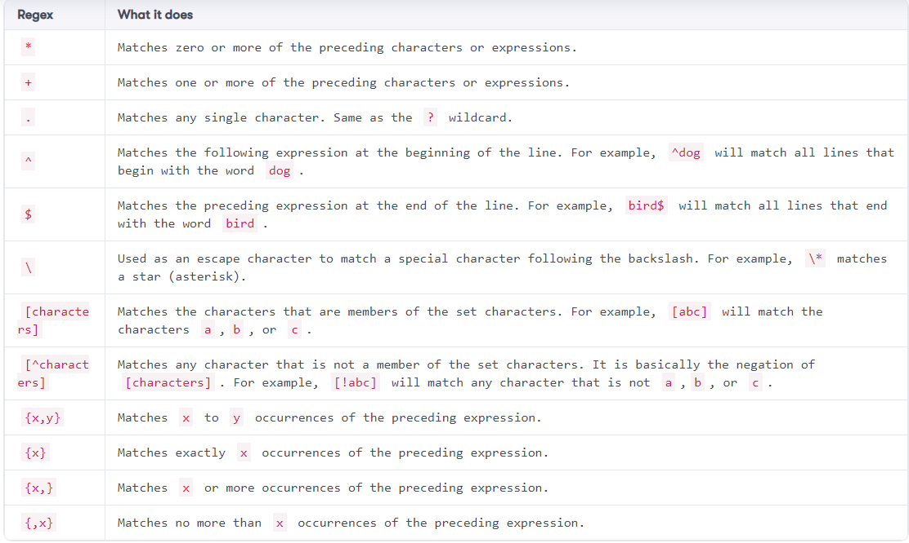
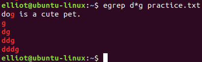

Lab: Analyzing and Manipulating Files
=====================================


In this lab, you will learn various Linux commands that will help
you analyze and manipulate files. You will learn how to compare two
files and get the file size. You will also learn how to reveal the type
of a file and display the number of characters, words, and lines in a
file. Furthermore, you will learn how to sort files, remove duplicate
lines, and much more!


Spot the difference
===================


You can use the [diff] command to compare the contents of two
files and highlight the differences between them.

To demonstrate, let's first make a copy of the file [facts.txt]
named [facts2.txt]:

``` 
elliot@ubuntu-linux:~$ cp facts.txt facts2.txt
```

Now let's append the line [\"Brazil is a country.\"] to the file
[facts2.txt]:

``` 
elliot@ubuntu-linux:~$ echo "Brazil is a country." >> facts2.txt
```

Now, run the [diff] command on both files:

``` 
elliot@ubuntu-linux:~$ diff facts.txt facts2.txt 
12a13
> Brazil is a country.
```

Cool! It outputs the difference between the two files, which in this
case, is the line [Brazil is a country.]


Viewing file size
=================


You can use the [du] command to view file size. **du** stands for
**disk usage**. If you want to see how many bytes are in a file, you can
run the [du] command with the [-b] option:

``` 
elliot@ubuntu-linux:~$ du -b facts.txt
210 facts.txt
```

The [facts.txt] file has [210] bytes. One character is equal
to one byte in size, so now you know that the [facts.txt] file has
exactly [210] characters.

You can also use the [-h] option, which will print the file size
in a human-readable format. For example, to view the size of the
[dir1] directory and its contents, you can run:

``` 
elliot@ubuntu-linux:~$ du -h dir1 
4.0K     dir1/cities
16K     dir1/directory2 
24K     dir1
```


Counting characters, words, and lines
=====================================


The word count [wc] command is yet another very handy command. It
counts the number of lines, words, and characters in a file. For
example, to display the number of lines in the file [facts.txt],
you can use the [-l] option:

``` 
elliot@ubuntu-linux:~$ wc -l facts.txt
12 facts.txt
```

There are a total of [12] lines in the file [facts.txt]. To
display the number of words, you can use the [-w] option:

``` 
elliot@ubuntu-linux:~$ wc -w facts.txt
37 facts.txt
```

So there is a total of [37] words in the file [facts.txt].
To display the number of characters (bytes), you can use the [-c]
option:

``` 
elliot@ubuntu-linux:~$ wc -c facts.txt
210 facts.txt
```

There is a total of [210] characters in the file
[facts.txt]. Without any options, the [wc] command will
display the number of lines, words, and characters side by side:

``` 
elliot@ubuntu-linux:~$ wc facts.txt
12 37 210 facts.txt
```


Viewing the file type
=====================


You can determine a file's type by using the [file] command. For
example, if you want to determine the type of the file [/var], you
can run:

``` 
elliot@ubuntu-linux:~$ file /var
/var: directory
```

And as you would expect, the output shows that [/var] is a
directory. If you want to show the type of the [facts.txt] file,
you can run:

``` 
elliot@ubuntu-linux:~$ file facts.txt 
facts.txt: ASCII text
```

The output shows that [facts.txt] is an ASCII text file.

Now let's create a soft link named [soft.txt] to the
[facts.txt] file:

``` 
elliot@ubuntu-linux:~$ ln -s facts.txt soft.txt
```

And run the [file] command on [soft.txt]:

``` 
elliot@ubuntu-linux:~$ file soft.txt 
soft.txt: symbolic link to facts.txt
```

As you can see, it shows that [soft.txt] is a symbolic (soft) link
to [facts.txt].


Sorting files
=============


You can use the [sort] command to sort text files. For example,
you can view the [facts.txt] file in sorted alphabetical order by
running the command:

``` 
elliot@ubuntu-linux:~$ sort facts.txt 
Apples are red.
Bananas are yellow.
Cherries are red.
Cherries are red.
Cherries are red.
Cherries are red.
Earth is round.
Grapes are green.
Grass is green.
Linux is awesome!
Sky is high.
Swimming is a sport.
```

You can also use the [-r] option to sort in reverse order:

``` 
elliot@ubuntu-linux:~$ sort -r facts.txt 
Swimming is a sport.
Sky is high.
Linux is awesome!
Grass is green.
Grapes are green.
Earth is round.
Cherries are red.
Cherries are red.
Cherries are red.
Cherries are red.
Bananas are yellow.
Apples are red.
```

You can also use the [-n] option to sort by numerical values
rather than literal values.


Showing unique lines
====================


You can use the [uniq] command to omit repeated lines in a file.
For example, notice that the line [Cherries are red.] is included
four times in the file [facts.txt]:

To view [facts.txt] without repeated lines, you can run:

``` 
elliot@ubuntu-linux:~$ uniq facts.txt 
Apples are red.
Grapes are green.
Bananas are yellow.
Cherries are red.
Sky is high.
Earth is round.
Linux is awesome!
Cherries are red.
Grass is green.
Swimming is a sport.
```

Notice that [Cherries are red.] is still shown twice in the
output. That's because the [uniq] command only omits repeated
lines but not duplicates! If you want to omit duplicates, you have to
[sort] the file first and then use a pipe to apply the
[uniq] command on the sorted output:

``` 
elliot@ubuntu-linux:~$ sort facts.txt | uniq 
Apples are red.
Bananas are yellow.
Cherries are red.
Earth is round.
Grapes are green.
Grass is green.
Linux is awesome!
Sky is high.
Swimming is a sport.
```

Boom! We have successfully omitted repeated and duplicate lines.


Searching for patterns
======================


The [grep] command is one of the most popular and useful commands
in Linux. You can use [grep] to print the lines of text that match
a specific pattern. For example, if you want to only display the lines
that contain the word [green] in [facts.txt], you can run:

``` 
elliot@ubuntu-linux:~$ grep green facts.txt 
Grapes are green.
Grass is green.
```

As you can see, it only printed the two lines that contain the word
[green].

The [grep] command can also be very useful when used with pipes.
For example, to only list the [txt] files in your home directory,
you can run the command:

``` 
elliot@ubuntu-linux:~$ ls | grep txt 
all.txt
error.txt 
facts2.txt 
facts.txt 
Mars.txt 
mydate.txt 
output.txt 
planets.txt 
soft.txt
```

You can use the [-i] option to make your search case-insensitive.
For example, if you want to print the lines that contain the word
[Earth] in [facts.txt], then use the command:

``` 
elliot@ubuntu-linux:~$ grep earth facts.txt 
elliot@ubuntu-linux:~$
```

This will show no result because [grep] is case-sensitive by
default. However, if you pass the [-i] option:

``` 
elliot@ubuntu-linux:~$ grep -i earth facts.txt 
Earth is round.
```

It will make the search case-insensitive, and hence it will display the
line [Earth is round.]


The stream editor
=================


You can use the stream editor command [sed] to filter and
transform text. For example, to substitute the word [Sky] with the
word [Cloud] in [facts.txt], you can run the command:

``` 
elliot@ubuntu-linux:~$ sed 's/Sky/Cloud/' facts.txt 
Apples are red.
Grapes are green.
Bananas are yellow.
Cherries are red.
Cloud is high.
Earth is round.
Linux is awesome!
Cherries are red.
Cherries are red.
Cherries are red.
Grass is green.
Swimming is a sport.
```

As you can see in the output, the word [Sky] is replaced with
[Cloud]. However, the file [facts.txt] is not edited. To
overwrite (edit) the file, you can use the [-i] option:

``` 
elliot@ubuntu-linux:~$ sed -i 's/Sky/Cloud/' facts.txt 
elliot@ubuntu-linux:~$ cat facts.txt
Apples are red.
Grapes are green.
Bananas are yellow.
Cherries are red.
Cloud is high.
Earth is round.
Linux is awesome!
Cherries are red.
Cherries are red.
Cherries are red.
Grass is green.
Swimming is a sport.
```

As you can see, the change is reflected in the file.


Translating characters
======================

One popular use of the [tr] command is to change lower case
letters to upper case (or vice versa). For example, if you want to
display all the words in [facts.txt] in upper case, you can run:

``` 
elliot@ubuntu-linux:~$ cat facts.txt | tr [:lower:] [:upper:] 
APPLES ARE RED.
GRAPES ARE GREEN.
BANANAS ARE YELLOW.
CHERRIES ARE RED.
CLOUD IS HIGH.
EARTH IS ROUND.
LINUX IS AWESOME!
CHERRIES ARE RED.
CHERRIES ARE RED.
CHERRIES ARE RED.
GRASS IS GREEN.
SWIMMING IS A SPORT.
```

You can also display all the words in lower case:

``` 
elliot@ubuntu-linux:~$ cat facts.txt | tr [:upper:] [:lower:] 
apples are red.
grapes are green. 
bananas are yellow. 
cherries are red. 
cloud is high. 
earth is round. 
linux is awesome! 
cherries are red. 
cherries are red. 
cherries are red. 
grass is green. 
swimming is a sport.
```

You can also use the [-d] option to delete characters. For
example, to remove all spaces in [facts.txt], you can run:

``` 
elliot@ubuntu-linux:~$ cat facts.txt | tr -d ' ' 
Applesarered.
Grapesaregreen.
Bananasareyellow.
Cherriesarered.
Cloudishigh.
Earthisround.
Linuxisawesome!
Cherriesarered.
Cherriesarered.
Cherriesarered.
Grassisgreen.
Swimmingisasport.
```


**A COOL TIP**

The [tr] command doesn't change (edit) the contents of the file.
It just writes the changes to the standard output. However, you can use
output redirection to store the output into another file.


For example, running the command:

``` 
elliot@ubuntu-linux:~$ cat facts.txt | tr [:lower:] [:upper:] > upper.txt
```

will store the output of the command:

``` 
cat facts.txt | tr [:lower:] [:upper:]
```

into the file [upper.txt].


Cutting text
============


If you want to view only a part (or a section) of a file, then the
[cut] command can prove very helpful. For instance, you can see
that each line in the [facts.txt] file consists of several words
that are separated by a single space. If you only want to view the first
word in each line (first column/field), then you can run the following
command:

``` 
elliot@ubuntu-linux:~$ cut -d ' ' -f1 facts.txt 
Apples
Grapes 
Bananas 
Cherries 
Cloud 
Earth 
Linux 
Cherries 
Cherries 
Cherries 
Grass 
Swimming
```

The [-d] option is the delimiter, and it has to be a single
character. In this case, I chose the delimiter to be the space character
[\' \']. I also used the [-f1] option to view only the first
field (column).

If you want to view the third word of each line (third field), then you
can use [-f3] instead of [-f1] as follows:

``` 
elliot@ubuntu-linux:~$ cut -d ' ' -f3 facts.txt 
red.
green. 
yellow. 
red. 
high. 
round. 
awesome! 
red. 
red. 
red. 
green.     
a
```

You can also select more than one field at a time. For example, to view
the first and the third word of each line, you can use [-f1,3]:

``` 
elliot@ubuntu-linux:~$ cut -d ' ' -f1,3 facts.txt 
Apples red.
Grapes green.
Bananas yellow.
Cherries red.
Cloud high.
Earth round.
Linux awesome!
Cherries red.
Cherries red.
Cherries red.
Grass green.
Swimming a

```


Text processing with awk
========================

You can use [awk] to achieve the same functionality as the
[cut] command. For example, to view the first word of each line in
the file [facts.txt], you can run:

``` 
elliot@ubuntu-linux:~$ awk '{print $1}' facts.txt 
Apples
Grapes 
Bananas 
Cherries 
Cloud 
Earth 
Linux 
Cherries 
Cherries 
Cherries 
Grass 
Swimming
```

Notice we didn't need to specify the space character [\' \'] as a
delimiter as we did with the [cut] command and that's because
[awk] is smart enough to figure it out on its own. You can also
view more than one field at a time; for example, to view the first and
the second word of each line, you can run:

``` 
elliot@ubuntu-linux:~$ awk '{print $1,$2}' facts.txt 
Apples are
Grapes are 
Bananas are 
Cherries are 
Cloud is 
Earth is 
Linux is 
Cherries are 
Cherries are 
Cherries are 
Grass is 
Swimming is
```

One advantage [awk] has over [cut] is that [awk] is
smart enough to separate the file into different fields even if there is
more than one character separating each field. The [cut] command
only works if the file has a single delimiter like a single space, a
colon, a comma, and so on.

To demonstrate, create a file named [animals.txt] and insert these
four lines:

``` 
fox        is smart
whale is   big
cheetah  is           fast 
penguin     is cute
```

Do not edit the format; keep the spaces messed up:

``` 
elliot@ubuntu-linux:~$ cat animals.txt 
fox        is smart
whale is   big
cheetah  is           fast 
penguin     is cute
```

Now, if you try to use the [cut] command to only show the third
word in each line, it will fail because there is more than one space
separating each word.

However, [awk] is smart enough to figure it out:

``` 
elliot@ubuntu-linux:~$ awk '{print $3}' animals.txt 
smart
big 
fast 
cute
```

As you can see, the third word in each line is displayed. You can also
use [awk] to search for patterns, just like the [grep]
command. For example, to print the lines that contain the word
[red] in [facts.txt], you can run the command:

``` 
elliot@ubuntu-linux:~$ awk '/red/{print}' facts.txt 
Apples are red.
Cherries are red. 
Cherries are red. 
Cherries are red. 
Cherries are red.

```


Wildcard characters
===================


The wildcard characters are special characters in Linux, and they are
used to specify a group (class) of characters. Let's look at some examples. You can
use the [\*] wildcard to list all the [txt] files in your
home directory:

``` 
elliot@ubuntu-linux:~$ ls -l *.txt
-rw-rw-r-- 1 elliot elliot  96 May 11 07:01 all.txt
-rw-rw-r-- 1 elliot elliot  91 May 12 06:10 animals.txt
-rw-rw-r-- 1 elliot elliot  92 May 11 06:48 error.txt
-rw-rw-r-- 1 elliot elliot 231 May 11 08:28 facts2.txt
-rw-rw-r-- 1 elliot elliot 212 May 11 18:37 facts.txt
-rw-rw-r-- 1 elliot elliot  18 May 11 06:12 Mars.txt
-rw-rw-r-- 1 elliot elliot  29 May 11 06:34 mydate.txt
-rw-rw-r-- 1 elliot elliot  57 May 11 07:00 output.txt
-rw-rw-r-- 1 elliot elliot  57 May 11 06:20 planets.txt
lrwxrwxrwx 1 elliot elliot  9  May  8 22:02 soft.txt -> facts.txt
-rw-rw-r-- 1 elliot elliot 212 May 12 05:09 upper.txt
```

If you want to list only the filenames that begin with the letter
[f], you can use [f\*]:

``` 
elliot@ubuntu-linux:~$ ls -l f*
-rw-rw-r-- 1 elliot elliot 231 May 11 08:28 facts2.txt
-rw-rw-r-- 1 elliot elliot 212 May 11 18:37 facts.txt
```

If you want to list the filenames that contain three letters followed by
a [.txt] extension, then you can use the [?] wildcard:

``` 
elliot@ubuntu-linux:~$ ls -l ???.txt
-rw-rw-r-- 1 elliot elliot 96 May 11 07:01 all.txt
```

You can also use more than one wildcard at the same time. For example,
if you want to list only the filenames that begin with the letter
[a] or [f], you can use the [\[af\]] wildcard followed
by the [\*] wildcard:

``` 
elliot@ubuntu-linux:~$ ls -l [af]*
-rw-rw-r-- 1 elliot elliot 96 May 11 07:01 all.txt
-rw-rw-r-- 1 elliot elliot 91 May 12 06:10 animals.txt
-rw-rw-r-- 1 elliot elliot 231 May 11 08:28 facts2.txt
-rw-rw-r-- 1 elliot elliot 212 May 11 18:37 facts.txt
```

You can also use set negations, for example, to list all the
[.txt] filenames that begin with any letter other than [f],
you can run use [\[!f\]\*]:

``` 
elliot@ubuntu-linux:~$ ls -l [!f]*.txt
-rw-rw-r-- 1 elliot elliot 96 May 11 07:01 all.txt
-rw-rw-r-- 1 elliot elliot 91 May 12 06:10 animals.txt
-rw-rw-r-- 1 elliot elliot 92 May 11 06:48 error.txt
-rw-rw-r-- 1 elliot elliot 18 May 11 06:12 Mars.txt
-rw-rw-r-- 1 elliot elliot 29 May 11 06:34 mydate.txt
-rw-rw-r-- 1 elliot elliot 57 May 11 07:00 output.txt
-rw-rw-r-- 1 elliot elliot 57 May 11 06:20 planets.txt
lrwxrwxrwx 1 elliot elliot 9 May 8 22:02 soft.txt -> facts.txt
-rw-rw-r-- 1 elliot elliot 212 May 12 05:09 upper.txt
```

Now, before we do some examples of character classes, let's create the
following four files:

``` 
elliot@ubuntu-linux:~$ touch One TWO 7wonders GTA1
```

Now, if you want to list the filenames that end with an upper case
letter, you can use the character class [\[:upper:\]] as follows:

``` 
elliot@ubuntu-linux:~$ ls -l *[[:upper:]]
-rw-rw-r-- 1 elliot elliot 0 May 12 18:14 TWO
```

Notice that the character class itself is also surrounded by brackets.

If you want to list the filenames that begin with a digit (number), you
can use the character class [\[:digit:\]] as follows:

``` 
elliot@ubuntu-linux:~$ ls -l [[:digit:]]*
-rw-rw-r-- 1 elliot elliot 0 May 12 18:14 7wonders
```

And the only match was the file [7wonders].


Regular expressions
===================


Up until now, we have been using wildcards with filenames. **Regular
expressions** (**Regex** for short) is another Linux feature that will
allow you to search for a specific pattern in text files. Regex is also
often used with the [grep] command.

Below table lists the most common regular expressions and their uses:



Well, that's a long list of regular expressions. Let's do some practice
with them. Create a file named [practice.txt] that contains the
following text:

``` 
111222333
my cell number is 123-456-789. 
you are a smart man
man is a linux command. 
man ... oh man.
dog is a cute pet. 
g
dg 
ddg 
dddg
Two stars ** 
tan
tantan 
tantantan
```

To use regular expressions with the [grep] command, you can either
use the [-E] option or the [egrep] command. The
[egrep] command is simply an alias to [grep -E].

Now, notice that the [*\**] regex is different from the
[*\**] wildcard. To realize the difference, run the command:

``` 
elliot@ubuntu-linux:~$ egrep d*g practice.txt
```

This will give the following output:





Notice that [d\*g] didn't match the word [dog]; instead, it
matched with:

-   [g] (zero occurrences of d)
-   [dg] (one occurrence of d)
-   [ddg] (two occurrences of d)
-   [dddg] (three occurrences of d)

That's because the [*\** regex] matches zero or more of the
preceding characters or expressions, unlike the [*\** wildcard],
which matches any character.

Now, to match one or more occurrences of [d] followed by
[g], you can use the regex [d+g]:

``` 
elliot@ubuntu-linux:~$ egrep d+g practice.txt 
dg
ddg 
dddg
```

To match the special character [\*], you can use the backslash
between single or double quotes as follows:

``` 
elliot@ubuntu-linux:~$ egrep "\*" practice.txt 
Two stars **
```

To match any pattern that contains the letter [m] followed by any
single character, then the letter [n], you can run:

``` 
elliot@ubuntu-linux:~$ egrep m.n practice.txt 
you are a smart man
man is a linux command. 
man ... oh man.
```

To match the lines that begin with the word [man], you can run:

``` 
elliot@ubuntu-linux:~$ egrep ^man practice.txt 
man is a linux command.
man ... oh man.
```

To match the lines that end with the word [man], you can run:

``` 
elliot@ubuntu-linux:~$ egrep man$ practice.txt 
you are a smart man
```

You can use character classes as well. For example, to search for all
the lines that contain at least one digit, you can run:

``` 
elliot@ubuntu-linux:~$ egrep "[[:digit:]]{1,}" practice.txt 
111222333
my cell number is 123-456-789.
```


Knowledge check
===============


For the following exercises, open up your Terminal and try to solve the
following tasks:

1.  Display the size (in bytes) of the file [/etc/hostname].
2.  Display only the group names in the file [/etc/group].
3.  Display the total number of lines in the file [/etc/services].
4.  Display only the lines that contain the word \"bash\" in the file
    [/etc/passwd].
5.  Display the output of the [uptime] command in all uppercase
    letters.
