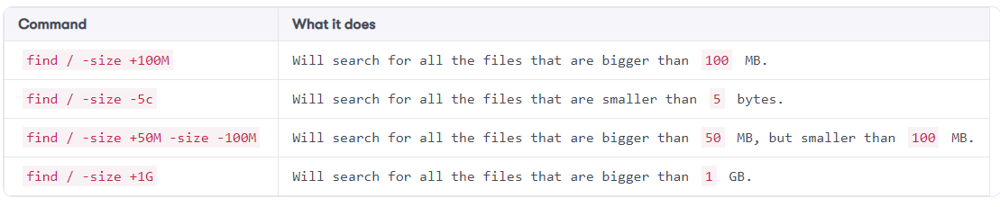

Lab: Find/Locate Files
----------------------

In this lab, you will learn two different ways you can use to search and locate files.


The locate command
==================


If you know the name of your file but you are unsure of the file's
location, you can use the [locate] command to get the file's path.

The [locate] command searches for a file location in a prebuilt
file database, and thus it's crucial to update the file database before
using the [locate] command. If you don't update the database, the
[locate] command may fail to retrieve the location of newly
created files.


Updating the file database
==========================


To update the file database, you have to run the [updatedb]
command as the root user:

``` 
root@ubuntu-linux:~# updatedb
```

The [updatedb] command will not display any output.

Now, let's say we forgot the location of the file [facts.txt], and
we don't remember where it is; in this case, you can run the
[locate] command followed by the filename:

``` 
root@ubuntu-linux:~# locate facts.txt
/home/elliot/facts.txt
```

BOOM! It displayed the location of the file [facts.txt].

Now I will show you what will happen if you search for a newly created
file without updating the file database.

Create an empty file named [ghost.txt] in the [/home]
directory:

``` 
root@ubuntu-linux:/# touch /home/ghost.txt
```

Now try searching for the file [ghost.txt]:

``` 
root@ubuntu-linux:/# locate ghost.txt 
root@ubuntu-linux:/#
```

The [locate] command couldn't find it! Why is that?\...\.....
That's because you created a new file, and the file database doesn't
know about it yet. You have to run the [updatedb] command first to
update the file database:

``` 
root@ubuntu-linux:/# updatedb 
root@ubuntu-linux:/# locate ghost.txt
/home/ghost.txt
```

YES! After you update the file database, the [locate] command can
now get the location of the file [ghost.txt].

You can also use wildcards with the [locate] command. For example,
[locate \*.log] will search for all the log files in your system.
You can also use the [-r] option to enable [regex] in your
search.


The find command
================

To search for all the [.txt] files under your
[/home] directory, you can run:

``` 
root@ubuntu-linux:~# find /home -name "*.txt"
/home/elliot/facts2.txt
/home/elliot/dir1/directory2/file1.txt
/home/elliot/dir1/directory2/file3.txt
/home/elliot/dir1/directory2/file2.txt
/home/elliot/soft.txt
/home/elliot/facts.txt
/home/elliot/practise.txt
/home/elliot/upper.txt
/home/elliot/mydate.txt
/home/elliot/all.txt
/home/elliot/Mars.txt
/home/elliot/output.txt
/home/elliot/planets.txt
/home/elliot/error.txt
/home/elliot/animals.txt
/home/ghost.txt
```

The [-name] option searches for filename; there are many other
options you can use with the [find] command.\
The [-type] option searches for file type; for example, to search
for all the directories in [/home/elliot/dir1], you can run:

``` 
root@ubuntu-linux:~# find /home/elliot/dir1 -type d
/home/elliot/dir1
/home/elliot/dir1/cities
/home/elliot/dir1/directory2
```

Notice it only listed the directories in [/home/elliot/dir1]. To
list regular files instead, you can run:

``` 
root@ubuntu-linux:~# find /home/elliot/dir1 -type f
/home/elliot/dir1/cities/paris
/home/elliot/dir1/cities/london
/home/elliot/dir1/cities/berlin
/home/elliot/dir1/directory2/file1.txt
/home/elliot/dir1/directory2/file3.txt
/home/elliot/dir1/directory2/file2.txt
```

To search for both regular files and directories, you can use a comma:

``` 
root@ubuntu-linux:~# find /home/elliot/dir1 -type d,f
/home/elliot/dir1
/home/elliot/dir1/cities
/home/elliot/dir1/cities/paris
/home/elliot/dir1/cities/london
/home/elliot/dir1/cities/berlin
/home/elliot/dir1/directory2
/home/elliot/dir1/directory2/file1.txt
/home/elliot/dir1/directory2/file3.txt
/home/elliot/dir1/directory2/file2.txt
```

Now as the root user create the two files [large.txt] and
[LARGE.TXT] in [/root]:

``` 
root@ubuntu-linux:~# touch large.txt LARGE.TXT
```

Let's say you forgot where these two files are located; in this case,
you can use [/] as your starting-point:

``` 
root@ubuntu-linux:~# find / -name large.txt
/root/large.txt
```

Notice it only listed the location of [large.txt]. What if you
wanted the other file [LARGE.TXT] as well? In this case, You can
use the [-iname] option, which makes the search case insensitive:

``` 
root@ubuntu-linux:~# find / -iname large.txt
/root/LARGE.TXT
/root/large.txt
```

Let's append the line \"12345\" to the file [large.txt]:

``` 
root@ubuntu-linux:~# echo 12345 >> large.txt
```

Notice the size of the files [large.txt] and [LARGE.txt]:

``` 
root@ubuntu-linux:~# du -b large.txt LARGE.TXT
6 large.txt
0 LARGE.TXT
```

The file [LARGE.TXT] is zero bytes in size because it's empty. You
can use the [-size] option to search for files based on their
size.

For example, to search for empty files under the [/root]
directory, you can run the command:

``` 
root@ubuntu-linux:~# find /root -size 0c
/root/LARGE.TXT
```

As you can see, it listed [LARGE.TXT] as it has zero characters;
[0c] means zero characters (or bytes). Now, if you want to search
for files of size [6] bytes under [/root], you can run:

``` 
root@ubuntu-linux:~# find /root -size 6c
/root/large.txt
```

As you can see, it listed the file [large.txt].

You can even use size ranges in your search; Below table shows you
some examples of using size ranges with the [find] command.



The [-mtime] and [-atime] options search for files based on
modification and access times. The [-exec] is also a useful
command option that allows you to run another command on the
[find] results.

For example, you can do a long-listing on all the empty files in
[/root] by running the command:

``` 
root@ubuntu-linux:~# find /root -size 0c -exec ls -l {} +
-rw-r--r-- 1 root root 0 May 16 14:31 /root/LARGE.TXT
```

A lot of people forget to include [{} +] when using the
[-exec] option; [{} +] references all the files that are
found in the find results.

You can use any command you want with the [-exec] option. For
example, instead of long-listing, you may want to remove the files you
get from the find results. In this case, you can run:

``` 
root@ubuntu-linux:~# find /root -size 0c -exec rm {} +
```

Now the file [LARGE.TXT] is removed:

``` 
root@ubuntu-linux:~# ls -l LARGE.TXT
ls: cannot access 'LARGE.TXT': No such file or directory
```


Knowledge check
===============


For the following exercises, open up your Terminal and try to solve the
following tasks:

1.  Use the [locate] command to find the path of the file
    [boot.log].
2.  Find all the files that are bigger than [50] MB in size.
3.  Find all the files that are between [70] MB and [100] MB
    in size.
4.  Find all the files that are owned by the user [smurf].
5.  Find all the files that are owned by the group [developers].
