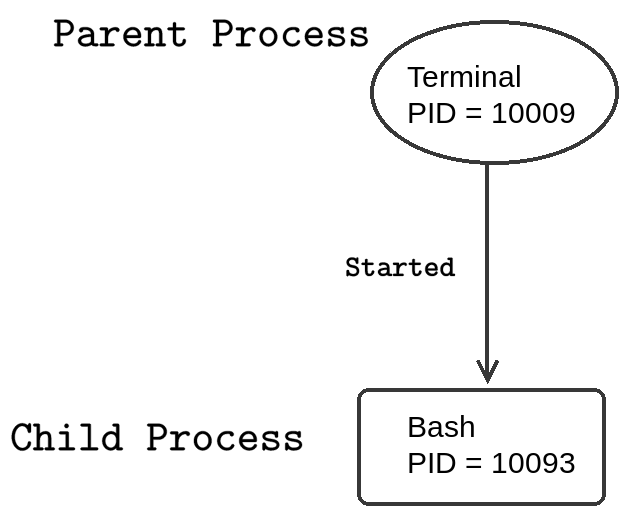
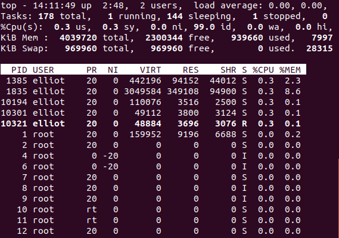
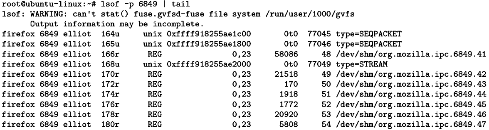

Lab: Controlling Processes
--------------------------


Any program that is running on your system is a process. In this
lab, you will learn all about Linux processes. You will learn how to
view process information. You will also learn how to send different
signals to a process. Furthermore, you will understand the differences
between foreground and background processes.


To list all the processes that are owned by a specific user, you can run
the command [ps -u] followed by the username:

``` 
ps -u username
```

For example, to list all the processes that are owned by [elliot],
you can run:

``` 
root@ubuntu-linux:~# ps -u elliot

PID TTY          TIME CMD
645 pts/0    00:00:00 bash
675 pts/0    00:00:00 bash
2387 pts/0    00:00:00 bash
4955 pts/0    00:00:00 bash
. 
. 
. 
.
```


You can use the [ps -e] command to list all the processes that are
running on your system:

``` 
root@ubuntu-linux:~# ps -e 
PID TTY     TIME  CMD
1  ?     00:00:01 systemd
2  ?     00:00:00 kthreadd
4  ?     00:00:00 kworker/0:0H
6  ?     00:00:00 mm_percpu_wq
7  ?     00:00:00 ksoftirqd/0
8  ?     00:00:00 rcu_sched
9  ?     00:00:00 rcu_bh
10 ?     00:00:00 migration/0
11 ?     00:00:00 watchdog/0
12 ?     00:00:00 cpuhp/0
13 ?     00:00:00 kdevtmpfs
.
.
.
.
```

You can also use the [-f] option to get more information:

``` 
root@ubuntu-linux:~# ps -ef
UID    PID  PPID C STIME TTY    TIME    CMD
root      1    0 0 11:23    ? 00:00:01 /sbin/init splash
root      2    0 0 11:23    ? 00:00:00 [kthreadd]
root      4    2 0 11:23    ? 00:00:00 [kworker/0:0H]
root      6    2 0 11:23    ? 00:00:00 [mm_percpu_wq]
root      7    2 0 11:23    ? 00:00:00 [ksoftirqd/0]
root      8    2 0 11:23    ? 00:00:01 [rcu_sched]
root      9    2 0 11:23    ? 00:00:00 [rcu_bh]
root     10    2 0 11:23    ? 00:00:00 [migration/0]
elliot 1835 1393 1 11:25 tty2 00:00:58 /usr/bin/gnome-shell
elliot 1853 1835 0 11:25 tty2 00:00:00 ibus-daemon --xim --panel disable
elliot 1857 1365 0 11:25    ? 00:00:00 /usr/lib/gnome-shell/gnome-shell
elliot 1865 1853 0 11:25 tty2 00:00:00 /usr/lib/ibus/ibus-dconf
elliot 1868    1 0 11:25 tty2 00:00:00 /usr/lib/ibus/ibus-x11 --kill-daemon
elliot 1871 1365 0 11:25    ? 00:00:00 /usr/lib/ibus/ibus-portal
. 
. 
. 
```

The first column of the output lists the usernames of the process
owners. The third column of the output lists the **parent process
identifiers** (**PPIDs**). Well, what the heck is a parent process?


Parent process versus child process
===================================


A parent process is a process that has started one or more child
processes. A perfect example will be your terminal and your bash shell;
when you open your terminal, your bash shell is started as well.

To get the PID of a process, you can use the [pgrep] command
followed by the process name:

``` 
pgrep process_name
```

For example, to get the PID of your terminal process, you can run:

``` 
elliot@ubuntu-linux:~$ pgrep terminal 
10009
```

The PID of my terminal is [10009]. Now, let\'s get the PID of the
bash process:

``` 
elliot@ubuntu-linux:~$ pgrep bash 
10093
```

The PID of my bash shell is [10093]. Now, you can get the
information of your bash process by using the [-p] option followed
by the bash PID:

``` 
elliot@ubuntu-linux:~$ ps -fp ADD_YOUR_BASH_PROCESS_ID
UID     PID   PPID  C  STIME  TTY   TIME   CMD
elliot 10093 10009  0  13:37 pts/1 00:00:00 bash
```

You can see from the output that the PPID of my bash process is equal to
the PID of my terminal process. This proves that the terminal process
has started the bash process. In this case, the bash process is referred
to as the child process of the terminal process:





The [top] command is a very useful command that you can use to
view processes\' information in real time. The output for the preceding command is shown in the following screenshot:





Foreground versus background processes
======================================


There are two types of processes in Linux:

-   Foreground processes
-   Background processes

The [yes] command outputs any string that follows it repeatedly
until killed:

``` 
elliot@ubuntu-linux:~$ whatis yes
yes (1)               - output a string repeatedly until killed
```

For example, to output the word [hello] repeatedly on your
terminal, you can run the command:

``` 
elliot@ubuntu-linux:~$ yes hello 
hello
hello 
hello 
hello 
hello 
hello 
hello 
hello 
hello 
hello
.
.
.
```

Notice that it will keep running, and you can\'t do anything else on
your terminal; this is a prime example of a foreground process. To claim
back your terminal, you need to kill the process. You can kill the
process by hitting the *Ctrl* + *C* key combination as follows:

``` 
hello 
hello 
hello 
hello 
hello
^C
elliot@ubuntu-linux:~$


```

As soon as you hit *Ctrl* + *C*, the process will be killed, and you can
continue using your terminal. Let\'s do another example; you can use the
[firefox] command to start up Firefox from your terminal:

``` 
elliot@ubuntu-linux:~$ firefox
```

The Firefox browser will start, but you will not be able to do anything
on your terminal until you close Firefox; this is another example of a
foreground process. Now, hit *Ctrl* + *C* to kill the Firefox process so
you can claim back your terminal.

You can start up Firefox as a background process by adding the ampersand
character as follows:

``` 
elliot@ubuntu-linux:~$ firefox &
[1] 3468
elliot@ubuntu-linux:~$
```

Firefox is now running as a background process, and you can continue
using your terminal without having to close Firefox.


Sending signals to processes
============================


You can interact and communicate with processes via signals. There are
various signals, and each signal serves a different purpose. To list all
available signals, you can run the [kill -L] command:

``` 
elliot@ubuntu-linux:~$ kill -L
1) SIGHUP 2) SIGINT 3) SIGQUIT 4) SIGILL 5) SIGTRAP
6) SIGABRT 7) SIGBUS 8) SIGFPE 9) SIGKILL 10) SIGUSR1
11) SIGSEGV 12) SIGUSR2 13) SIGPIPE 14) SIGALRM 15) SIGTERM
16) SIGSTKFLT 17) SIGCHLD 18) SIGCONT 19) SIGSTOP 20) SIGTSTP
21) SIGTTIN 22) SIGTTOU 23) SIGURG 24) SIGXCPU 25) SIGXFSZ
26) SIGVTALRM 27) SIGPROF 28) SIGWINCH 29) SIGIO 30) SIGPWR
31) SIGSYS 34) SIGRTMIN 35) SIGRTMIN+1 36) SIGRTMIN+2 37) SIGRTMIN+3
38) SIGRTMIN+4 39) SIGRTMIN+5 40) SIGRTMIN+6 41) SIGRTMIN+7 42) SIGRTMIN+8
43) SIGRTMIN+9 44) SIGRTMIN+10 45) SIGRTMIN+11 46) SIGRTMIN+12 47) SIGRTMIN+13
48) SIGRTMIN+14 49) SIGRTMIN+15 50) SIGRTMAX-14 51) SIGRTMAX-13 52) SIGRTMAX-12
53) SIGRTMAX-11 54) SIGRTMAX-10 55) SIGRTMAX-9 56) SIGRTMAX-8 57) SIGRTMAX-7
58) SIGRTMAX-6 59) SIGRTMAX-5 60) SIGRTMAX-4 61) SIGRTMAX-3 62) SIGRTMAX-2
63) SIGRTMAX-1 64) SIGRTMAX
```

Notice that every signal has a numeric value. For example, [19] is
the numeric value for the [SIGSTOP] signal.

To see how signals work, let\'s first start Firefox as a background
process:

``` 
elliot@ubuntu-linux:~$ firefox &
[1] 4218
```

Notice that the PID of Firefox is [4218] on my system. I can kill
(terminate) Firefox by sending a [SIGKILL] signal as follows:

``` 
elliot@ubuntu-linux:~$ kill -SIGKILL ADD_FIREFOX_PROCESS_ID
[1]+ Killed             firefox
```

This will immediately shut down Firefox. You can also use the numeric
value of the [SIGKILL] signal instead:

``` 
elliot@ubuntu-linux:~$ kill -9 ADD_FIREFOX_PROCESS_ID
```

In general, the syntax for the [kill] command is as follows:

``` 
kill -SIGNAL PID
```

Let\'s start Firefox again as a background process:

``` 
elliot@ubuntu-linux:~$ firefox & 
[1] 4907
```

Notice that the PID of Firefox is [4907] on my system. Now go
ahead and open google.com on Firefox. After you have done
that, go back to your terminal and send the [SIGSTOP] signal to
Firefox:

``` 
elliot@ubuntu-linux:~$ kill -SIGSTOP ADD_FIREFOX_PROCESS_ID
```

You will notice that Firefox becomes unresponsive; no problem -- we can fix that by sending the [SIGCONT]
signal to Firefox:

``` 
elliot@ubuntu-linux:~$ kill -SIGCONT ADD_FIREFOX_PROCESS_ID
```

This will resurrect Firefox, and your webpage will now resume.

So far, you have learned three signals:

-   [SIGKILL]: Terminates a process
-   [SIGSTOP]: Stops a process
-   [SIGCONT]: Continues a process

You can use process names instead of process identifiers with the
[pkill] command. For example, to close your terminal process, you
can run the command:

``` 
elliot@ubuntu-linux:~$ pkill -9 terminal
```

Now let\'s do something funny; open your terminal and run the command:

``` 
elliot@ubuntu-linux:~$ pkill -SIGSTOP terminal
```

Haha! Your terminal is now frozen. I will let you handle that!

Viewing a process priority
--------------------------

Start Firefox as a background process:

``` 
elliot@ubuntu-linux:~$ firefox &
 [1] 6849
```

**Note: Replace `6849` with your firefox processId in commands below.**

You can use the [ps] command to view a process\' nice value:

``` 
elliot@ubuntu-linux:~$ ps -o nice -p 6849
NI
0
```

My Firefox process has a nice value of **0**, which is the default value
(average priority).

Setting priorities for new processes
------------------------------------

You can use the [nice] command to start a process with your
desired priority.

Let\'s say you are about to upgrade all the packages on your system; it
would be wise to give such a process the highest priority possible. To
do that, you can run the following command as the [root] user:

``` 
root@ubuntu-linux:~# nice -n -20 apt-get upgrade
```

Changing a process priority
---------------------------

You can use the [renice] command to change the priority of a
running process. We have already seen that Firefox was running with a
default process priority of zero; let\'s change Firefox\'s priority and
give it the lowest priority possible:

``` 
root@ubuntu-linux:~# renice -n 19 -p 6849
6849 (process ID) old priority 0, new priority 19
```

Cool! Now I hope Firefox will not be very slow for me; after all, I just
told my CPU not to give much attention to Firefox!


The /proc directory
===================


Every process in Linux is represented by a directory in [/proc].
For example, if your Firefox process has a PID of [6849], then the
directory [/proc/6849] will represent the Firefox process:

``` 
root@ubuntu-linux:~# pgrep firefox
6849
root@ubuntu-linux:~# cd /proc/6849
root@ubuntu-linux:/proc/6849#
```

Inside a process\' directory, you can find a lot of valuable and
insightful information about the process. For example, you will find a
soft link named [exe] that points to the process\' executable
file:

``` 
root@ubuntu-linux:/proc/6849# ls -l exe
lrwxrwxrwx 1 elliot elliot 0 Nov 21 18:02 exe -> /usr/lib/firefox/firefox
```

You will also find the [status] file, which stores various pieces
of information about a process; these include the process state, the
PPID, the amount of memory used by the process, and so on:

``` 
root@ubuntu-linux:/proc/6849# head status 
Name: firefox
Umask: 0022
State: S (sleeping) Tgid: 6849
Ngid: 0
Pid: 6849
PPid: 1990
TracerPid: 0
Uid: 1000 1000 1000 1000
Gid: 1000 1000 1000 1000
```

The [limits] file displays the current limits set for the process:

``` 
root@ubuntu-linux:/proc/7882# cat limits
Limit                  Soft Limit   Hard Limit   Units
Max cpu time           unlimited    unlimited    seconds
Max file size          unlimited    unlimited    bytes
Max data size          unlimited    unlimited    bytes
Max stack size         8388608      unlimited    bytes
Max core file size     0            unlimited    bytes
Max resident set       unlimited    unlimited    bytes
Max processes          15599        15599        processes
Max open files         4096         4096         files
Max locked memory      16777216     16777216     bytes
Max address space      unlimited    unlimited    bytes
Max file locks         unlimited    unlimited    locks
Max pending signals    15599        15599        signals
Max msgqueue size      819200       819200       bytes
Max nice priority      0            0 
Max realtime priority  0            0 
Max realtime timeout   unlimited    unlimited    us
```

The [fd] directory will show you all the files that the process is
currently using on your system:


You can also use the [lsof] command to list all the files a
process is using:





Knowledge check
===============


For the following exercises, open up your Terminal and try to solve the
following tasks:

1.  List the process ID of your running terminal.
2.  List the parent process ID of your running terminal.
3.  Use the [kill] command to close your terminal.
4.  Start Firefox as a background process.
5.  Change Firefox\'s priority to a maximum priority.
