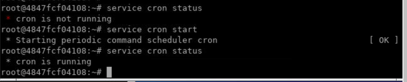
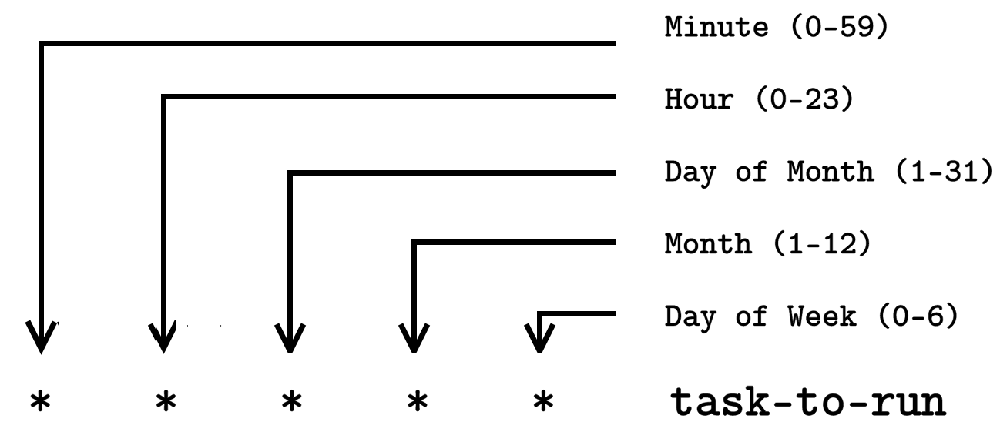
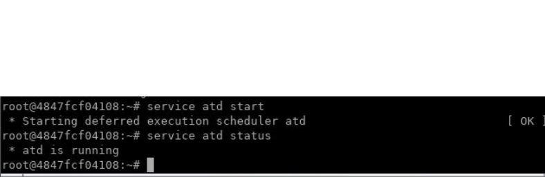

Lab: You Need a Cron Job
========================


In this lab, you will learn how to automate boring tasks in Linux by
using cron jobs, which is one of the most useful and powerful utilities
in Linux. Thanks to cron jobs, Linux system administrators can rest on
the weekend and enjoy their vacation with their beloved ones. Cron jobs
allow you to schedule tasks to run at a specific time. With cron jobs,
you can schedule to run backups, monitor system resources, and much
more.

Make sure to start cron service before starting the lab:

```
service cron start

service cron status
```




Our first cron job
==================

The following diagram shows you the typical format for a cron job:





Cron jobs are user-specific, and so each user has their own list of cron
jobs. For example, the user [elliot] can run the command [crontab
-l] to display his their of cron jobs:

``` 
elliot@ubuntu-linux:~$ crontab -l 
no crontab for elliot
```

Currently, the user [elliot] doesn\'t have any cron jobs.

Let\'s go ahead and create Elliot\'s first cron job. We will create a
cron job that will run every minute, and it will simply append the line
\"A minute has passed.\" to the file [/home/elliot/minutes.txt].

You can run the command [crontab -e] to edit or create cron jobs:

``` 
elliot@ubuntu-linux:~$ crontab -e
```

Now add the following line and then save and exit:

``` 
* * * * * echo "A minute has passed." >> /home/elliot/minutes.txt
```

After you exit, you will see the message: \"crontab: installing new
crontab\":

``` 
elliot@ubuntu-linux:~$ crontab -e 
crontab: installing new crontab
```

Finally, the user [elliot] can list their cron jobs to verify that
the new cron job is scheduled:

``` 
elliot@ubuntu-linux:~$ crontab -l
* * * * * echo "A minute has passed." >> /home/elliot/minutes.txt
```

Now, wait for a few minutes and then check the contents of the file
[/home/elliot/minutes.txt]:

``` 
elliot@ubuntu-linux:~$ cat /home/elliot/minutes.txt 
A minute has passed.
A minute has passed. 
A minute has passed. 
A minute has passed. 
A minute has passed.
```

I waited five minutes, and then I viewed the file to see that the line
\"A minute has passed.\" was added five times to the file
[minutes.txt], so I know the cron job is working fine.


Run every five minutes
======================


Let\'s create another cron job that will run every five minutes. For
example, you may want to create a cron job that checks the load average
on your system every five minutes.

Run the command [crontab -e] to add a new cron job:

``` 
elliot@ubuntu-linux:~$ crontab -e
```

Now add the following line and then save and exit:

``` 
*/5 * * * * uptime >> /home/elliot/load.txt
```

Finally, let\'s view the list of installed cron jobs to verify that the
new cron job is scheduled:

``` 
elliot@ubuntu-linux:~$ crontab -e 
crontab: installing new crontab 
elliot@ubuntu-linux:~$ crontab -l
* * * * * echo "A minute has passed" >> /home/elliot/minutes.txt
*/5 * * * * uptime >> /home/elliot/load.txt
```

Now we can see there are two cron jobs installed for the user
[elliot].

Hang around for five or ten minutes and then check the contents of the
file [/home/elliot/load.txt]. If you don\'t have a stopwatch, run
the command [sleep 300] and wait until it finishes:

``` 
elliot@ubuntu-linux:~$ sleep 300
```

I made myself some green tea, and then came back after ten minutes and
viewed the file [/home/elliot/load.txt]:

``` 
elliot@ubuntu-linux:~$ cat /home/elliot/load.txt
14:40:01 up 1 day, 5:13, 2 users, load average: 0.41, 0.40, 0.37
14:45:01 up 1 day, 5:18, 2 users, load average: 0.25, 0.34, 0.35
```

The cron job ran twice in those ten minutes as expected; I recommend you
check the file [/home/elliot/load.txt] again in twenty-four hours,
and you will see a pretty lovely report for your system load average
throughout the day.


More cron examples
==================


You can also schedule your cron job to run at multiple time intervals.
For example, the following cron job will run every hour on Sunday at the
minutes [5], [20], and [40]:

``` 
5,20,40 * * * sun task-to-run
```

You can also specify a time range. For example, a cron job that will run
at [6:30] PM on [weekdays] (Monday -\> Friday) will have the
following format:

``` 
30 18 * * 1-5 task-to-run
```

Notice that [0] is Sunday, [1] is Monday, and so on.


Automating system patching
==========================


As a Linux system administrator, you get to patch (update) systems quite
often. And sometimes, it may drive you insane as production servers are
scheduled to update at unpleasant times, like midnight on the weekends,
[04:00] AM, [02:00] AM, etc. It would be nice to automate
such a hectic task and get more sleep, right?

Let\'s switch to the [root] user and then create a bash script
named [auto\_patch.sh]

in [/root]:

``` 
root@ubuntu-linux:~# cat auto_patch.sh 
#!/bin/bash
apt-get -y update 
apt-get -y upgrade 
```

Notice that the script [auto\_patch.sh] is tiny; only three lines.
We have used the\
[-y] option with the [apt-get] commands, which automatically
answers [Yes] to all prompts during the system update; this is
important because you will not be sitting in front of the computer while
the script is running!

Now make the script executable:

``` 
root@ubuntu-linux:~# chmod +x auto_patch.sh
```

Finally, you need to schedule a cron job to run the
[auto\_patch.sh] script. Let\'s assume the system is scheduled to
update on Saturday at 01:00 AM. In this case, you can create the
following cron job:

``` 
0 1 * * sat /root/auto_patch.sh
```

Keep in mind that [auto\_patch.sh] will never be deployed on any
real server. I was only opening your mind to the concept of automation.
You need to edit [auto\_patch.sh] to check for command exit codes
as it\'s naive to expect that everything will go smoothly without any
errors. A good system administrator always creates robust scripts that
handle all kinds of expected errors.


Running a job once
==================


You have to remove the [auto\_patch.sh] cron job sometime after it
runs, or else it will keep updating the system every week! For this,
there exists another utility called [at] for that sole purpose;
that is, to schedule to run a job just once.

We first need to install the [at] package:

``` 
root@ubuntu-linux:~# apt-get -y install at

root@ubuntu-linux:~# service atd start

root@ubuntu-linux:~# service atd status
```



Now you can schedule to run the [auto\_patch.sh] script this
coming Saturday at [01:00] AM with the following command:

``` 
root@ubuntu-linux:~# at 01:00 AM Sat -f /root/auto_patch.sh
```

Remember, [at] jobs only run once, so after Saturday, the
[auto\_patch.sh] script will not run again.


Knowledge check
===============


For the following exercises, open up your terminal and try to solve the
following tasks:

1.  Create a cron job for the root user that will run every 10 minutes.
    The cron job will simply append the line \"10 minutes have passed!\"
    to the file [/root/minutes.txt].
2.  Create a cron job for the root user that will run every Christmas
    ([25th of December at 1 AM]). The cron job will simply append
    the line \"Merry Christmas!\" to the file
    [/root/holidays.txt].
