Lab: The Linux File System
==========================


In this lab, you will climb a very special tree, which is the Linux
filesystem. During this climbing journey, you will learn:

-   The Linux filesystem hierarchy.
-   What is the root directory?
-   Absolute versus Relative paths.
-   How to navigate the Linux filesystem.


The Linux filesystem
====================


Alright, you are at the root of the tree and ready to climb up. In
Linux, just like an actual tree, the beginning of the filesystem starts
at the root directory. You can use the [cd] command followed by a
forward slash to get to the root:

``` 
elliot@ubuntu-linux:~$ cd /
```

The [cd] command is short for **Change Directory** and is one of
the most used commands in Linux. You can\'t move around in Linux without
it. It\'s like your limbs (arms and legs), can you climb a tree without
your limbs?\
The forward slash character represents the root directory. Now to make
sure you\'re at the root directory, you can run [pwd]:

``` 
elliot@ubuntu-linux:~$ pwd
/
```

And sure enough, we are at the root of the Linux filesystem. Whenever
you are lost and you don\'t know where you are, [pwd] is here to
rescue you.

Alright, while we are still at the root directory, let\'s see what\'s in
there! Run the [ls] command to view the contents of the current
directory:

``` 
elliot@ubuntu-linux:/$ ls
bin etc lib proc tmp var boot 
dev home opt root sbin usr
```

To have a better view of the contents, you can use the long listing
[-l] option with the [ls] command:

``` 
elliot@ubuntu-linux:/$ ls -l

lrwxrwxrwx   1 root root    7 Jul  3  2020 bin -> usr/bin
drwxr-xr-x   2 root root 4096 Apr 15  2020 boot
drwxr-xr-x  12 root root 3620 Mar 15 06:14 dev
drwxr-xr-x   1 root root 4096 Mar 15 06:14 etc
drwxr-xr-x   1 root root 4096 Mar 12 23:10 home
lrwxrwxrwx   1 root root    7 Jul  3  2020 lib -> usr/lib
lrwxrwxrwx   1 root root    9 Jul  3  2020 lib32 -> usr/lib32
lrwxrwxrwx   1 root root    9 Jul  3  2020 lib64 -> usr/lib64
lrwxrwxrwx   1 root root   10 Jul  3  2020 libx32 -> usr/libx32
drwxr-xr-x   2 root root 4096 Jul  3  2020 media
drwxr-xr-x   2 root root 4096 Jul  3  2020 mnt
drwxrwxrwx   1 root root 4096 Jan 21  2021 opt
dr-xr-xr-x 214 root root    0 Mar 15 06:14 proc
drwxr-xr-x   1 root root 4096 Apr 10  2021 root
drwxr-xr-x   1 root root 4096 Mar 15 06:14 run
lrwxrwxrwx   1 root root    8 Jul  3  2020 sbin -> usr/sbin
drwxr-xr-x   2 root root 4096 Jul  3  2020 srv
-rwxr-xr-x   1 root root 4046 Apr 16  2021 startup.sh
dr-xr-xr-x  13 root root    0 Mar 15 06:14 sys
drwxrwxrwt   1 root root 4096 Mar 15 06:14 tmp
drwxr-xr-x   1 root root 4096 Jul 22  2020 usr
drwxr-xr-x   1 root root 4096 Jul 22  2020 var
```

This output gives you a lot of valuable information that we will discuss
in detail in the upcoming labs. But for now, we focus on the first
letter in the first column of the output. Take a look at the first
column of the output:

``` 
drwxr-xr-x 
drwxr-xr-x 
drwxr-xr-x 
drwxr-xr-x
.
.
.
.
```

You will see that the first letter is [d], which means that the
file is a directory. The first letter reveals the file type. The last
column of the output displays the filename.

Alright, now let\'s do further climbing on the Linux directory tree.
Take a look at *figure 1*, and you will understand why we choose a tree
to describe the structure of the Linux filesystem.

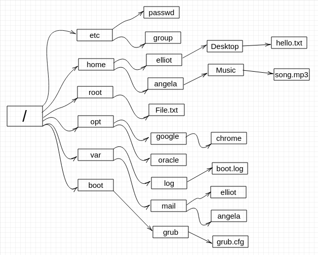


The preceding figure only features very few files and by no means is a
representation for the whole directory tree, as the Linux filesystem
literally contains thousands of files. So you can think of the preceding
figure as a subtree of the actual Linux directory tree.


Navigating through the directory tree
=====================================


Alright, let\'s do more climbing. For example, let\'s climb to the
[/home] directory to see how many users we have on the system. You
can do that by simply running the [cd /home] command:

``` 
elliot@ubuntu-linux:~$ cd /home 
elliot@ubuntu-linux:/home$
```

Notice how your command prompt changes as it\'s now showing that you are
at the home directory.


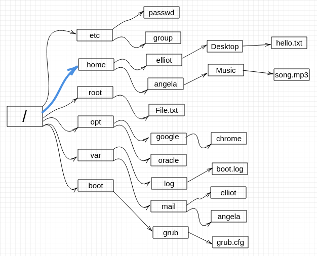


Now let\'s run [ls] to view the contents of the [/home]
directory:

``` 
elliot@ubuntu-linux:/home$ ls 
angela elliot
```

These are the two users on my system (besides the root user). The
[/root] is the home directory for the root user.


**WHO IS ROOT?**

The root user is a superuser who is allowed to do anything on the
system. The root user can install software, add users, manage disk
partitions, etc. The home directory of the root user is [/root],
which is NOT to be confused with [/] (the root of the filesystem).


If you want proof that you are currently at the [/home] directory,
you can run the [pwd] command:

``` 
elliot@ubuntu-linux:/home$ pwd
/home
```

Sure enough! We are at the [/home] directory. Now let\'s climb to
the home directory of user [elliot]. Now, believe it or not, there
are two ways to navigate to [elliot]\'s home directory. You can
simply run the [cd elliot] command:

``` 
elliot@ubuntu-linux:/home$ cd elliot 
elliot@ubuntu-linux:~$ pwd
/home/elliot
```

Or you can run the [cd /home/elliot] command:

``` 
elliot@ubuntu-linux:/home$ cd /home/elliot 
elliot@ubuntu-linux:~$ pwd
/home/elliot
```


Notice that both commands have landed us in [elliot]\'s home
directory. However, running [cd elliot] is much easier than
running [cd /home/elliot], of course.

Well, think about it, we were initially at the [/home] directory,
and that\'s why we were able to run [cd elliot] to land in
[/home/elliot].

However, in other situations, we would be forced to use the full path
(absolute path) [/home/elliot] to reach our destination. To
demonstrate, let\'s first change to the [/etc] directory:

``` 
elliot@ubuntu-linux:~$ cd /etc 
elliot@ubuntu-linux:/etc$ pwd
/etc
```


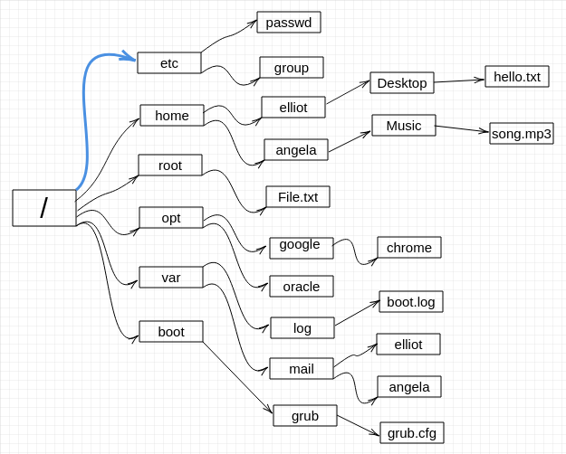


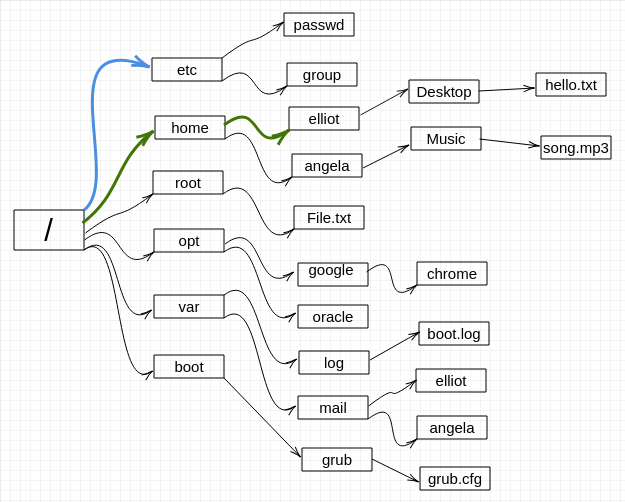


Above images help you visualize it. You are at [/etc] and
you want to go to [/home/elliot]. To get to [elliot]\'s home
directory, we can no longer use a short path (relative path) by running
the [cd elliot] command:

``` 
elliot@ubuntu-linux:/etc$ cd elliot
bash: cd: elliot: No such file or directory
```

As you can see, the Shell got mad and returned an error [bash: cd:
elliot: No such file or directory]. In this case, we have to use
the full path (absolute path)[/home/elliot]:

``` 
elliot@ubuntu-linux:/etc$ cd /home/elliot 
elliot@ubuntu-linux:~$ pwd
/home/elliot
```

In case you haven\'t noticed by now, we have been using the forward
slash ([/]) as a directory separator.


It\'s crucial to realize the difference between absolute paths and
relative paths.


**ABSOLUTE VERSUS RELATIVE PATHS**

The following diagram shows you the relative path
[Desktop/hello.txt] and will only work if your current working
directory is [/home/elliot].


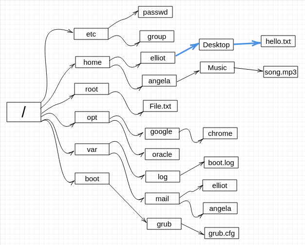


The following image shows you the absolute path
[/home/elliot/Desktop] and will always work regardless of your
current working directory.


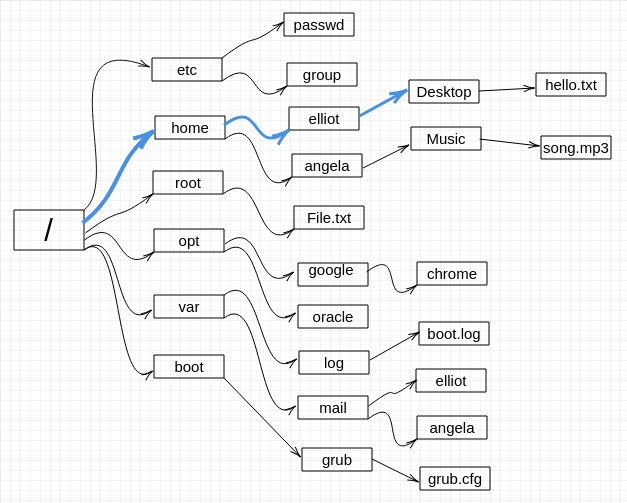


Now let\'s climb to Elliot\'s [Desktop] directory to see what he
has there. We will use an absolute path:

``` 
elliot@ubuntu-linux:/$ cd /home/elliot/Desktop 
elliot@ubuntu-linux:~/Desktop$ pwd
/home/elliot/Desktop
```

We follow it with a [pwd] to confirm that we are indeed in the
desired directory. Now let\'s run [ls] to view the contents of
Elliot\'s desktop:

``` 
elliot@ubuntu-linux:~/Desktop$ ls 
hello.txt
```

Notice that the file [hello.txt] is on Elliot\'s desktop.


You can use the [cat] command to view the contents of a text file:

``` 
elliot@ubuntu-linux:~/Desktop$ cat hello.txt 

Hello Friend!
```

If you open the file [hello.txt] on the desktop, you will see the
same contents, of course, as you can see in the following screenshot.


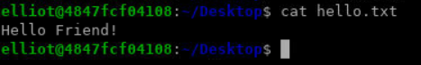


Parent and current directories
==============================


There are two special directories under every directory in the
filesystem:

1.  Current working directory represented by one dot ([.])
2.  Parent directory represented by two dots ([..])


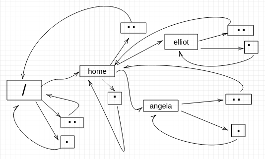


It\'s easy to understand both directories by going through a few
examples. To demonstrate, let\'s first change to [/home/elliot] so
that it becomes our current working directory:

``` 
elliot@ubuntu-linux:~/Desktop$ cd /home/elliot 
elliot@ubuntu-linux:~$ pwd
/home/elliot
```

Now run the [cd .] command:

``` 
elliot@ubuntu-linux:~$ cd . 
elliot@ubuntu-linux:~$ pwd
/home/elliot
```

As you would expect, nothing happened! We are still at
[/home/elliot], and that is because one dot ([.]) represents
the current working directory. It\'s like if you told someone, \"Go
where you are!\"

Now run the [cd ..] command:

``` 
elliot@ubuntu-linux:~$ cd .. 
elliot@ubuntu-linux:/home$ pwd
/home
```

We moved back one directory! In other words, we changed to the parent
directory of [/home/elliot], which is [/home].

Let\'s run another [cd ..]:

``` 
elliot@ubuntu-linux:/home$ cd .. 
elliot@ubuntu-linux:/$ pwd
/
```

Indeed we keep going back, and now we are at the root of our directory
tree. Well, let\'s run [cd ..] one more time:

``` 
elliot@ubuntu-linux:/$ cd .. 
elliot@ubuntu-linux:/$ pwd
/
```

Hmmm, we are at the same directory! Our path didn\'t change, and that\'s
because we are at the root of our directory tree already, so we can\'t
go any further back. As a result, the root directory ([/]) is the
only directory where the **parent directory = current directory**, and
you can visualize it by looking at *figure 10*.

You can also insert the directory separator [cd ../..] to move
back two directories at once:

``` 
elliot@ubuntu-linux:~$ pwd
/home/elliot
elliot@ubuntu-linux:~$ cd ../.. 
elliot@ubuntu-linux:/$ pwd
/
```

You can also run [cd ../../..] to move back three directories and
so on.


Moving around quickly
=====================


Now I will show you some cool tricks that will make you fast and
efficient in navigating the Linux directory tree.

Go back home!
-------------

Let\'s change to the [/var/log] directory:

``` 
elliot@ubuntu-linux:~$ cd /var/log 
elliot@ubuntu-linux:/var/log$ pwd
/var/log
```

You can now run the [cd \~] command to go to your home directory:

``` 
elliot@ubuntu-linux:/var/log$ cd ~ 
elliot@ubuntu-linux:~$ pwd
/home/elliot
```

WOW! Let\'s do it again, but this time, we switch to user
[angela]. In case you don\'t know, the character is called tilde
and should be located next to your number *1* key on your keyboard:

**Note** angela user password is : `angela`

``` 
elliot@ubuntu-linux:~$ whoami 
elliot
elliot@ubuntu-linux:~$ su angela 
Password:
angela@ubuntu-linux:/home/elliot$ whoami 
angela
```

Notice here I used two new commands. The [whoami] command prints
the name of the currently logged-in user. I also used the switch user
[su] command to switch to user [angela]. You can use the
[su] command to switch to any user on your system; you just need
to run [su], followed by the username.

Now, as user [angela], I will navigate to the [/var/log]
directory:

``` 
angela@ubuntu-linux:/home/elliot$ cd /var/log 
angela@ubuntu-linux:/var/log$ pwd
/var/log
```

Then I run the [cd \~] command:

``` 
angela@ubuntu-linux:/var/log$ cd ~ 
angela@ubuntu-linux:~$ pwd
/home/angela
```

Boom! I am at Angela\'s home directory. Regardless of your current
working directory, running the [cd \~] command will land you
straight to your home directory.

Take me back!
-------------

Now, what if [angela] wants to go back as quickly as possible to
her previous working directory?

Running the [cd -] command is the fastest method that will land
[angela] back to her previous working directory:

``` 
angela@ubuntu-linux:~$ pwd
/home/angela
angela@ubuntu-linux:~$ cd -
/var/log
```

Cool! [angela] is back in [/var/log]. So anytime you want to
go back to your previous working directory, just run the [cd -]
command.

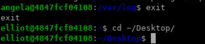


Hidden Files
============


The current directory [.] and the parent directory [..]
exist under each directory in the Linux filesystem. But how come we
can\'t see them when we run the [ls] command?

``` 
elliot@ubuntu-linux:~/Desktop$ cd ~/Desktop
elliot@ubuntu-linux:~/Desktop$ pwd
/home/elliot/Desktop 
elliot@ubuntu-linux:~/Desktop$ ls 
hello.txt
elliot@ubuntu-linux:~/Desktop$ ls -l 
total 4
-rw-r--r-- 1 elliot elliot 37 Jan 19 14:20 hello.txt
```

As you can see, I even tried to run [ls -l] and still can\'t see
the current directory or the parent directory.

You need to use the [-a] option with the [ls] command as
follows:

``` 
elliot@ubuntu-linux:~/Desktop$ ls -a
. .. hello.txt
```

Hooray! Now you can see all the files. The [-a] option shows you
all the files, including hidden files and of course you can use the full
option name [\--all], which will do the same thing:

``` 
elliot@ubuntu-linux:~/Desktop$ ls --all
. .. hello.txt
```

It turns out that any filename that starts with [.] (a dot) is
hidden.


Hidden filenames start with [.]

Any filename that starts with a dot is hidden. That\'s why current and
parent directories are hidden.


Now run the [ls -a] command:

``` 
elliot@ubuntu-linux:~$ cd ~
elliot@ubuntu-linux:~$ ls -a
.  ..  .bash_history  .bash_logout  .bashrc  .local  .profile  Desktop
```

You can now see the hidden files in your home directory! Notice all the
hidden filenames start with a dot.


Passing command arguments
=========================


So far, we ran the [ls] command only on the current working
directory. However, you can list the contents of any directory without
having to change to it. For example, if your current working directory
is [/home/elliot]:

``` 
elliot@ubuntu-linux:~$ pwd
/home/elliot
```

You can list all the files in [/home/angela] by running the [ls -a
/home/angela] command:

``` 
elliot@ubuntu-linux:~$ ls -a /home/angela
. .. .bash_history .bash_logout .bashrc Music .profile 
elliot@ubuntu-linux:~$ pwd
/home/elliot 
elliot@ubuntu
```

I was able to list the contents of [/home/angela] while still
being in [/home/elliot]. This is possible because the [ls]
command accepts any file as an argument.


**WHAT IS AN ARGUMENT?**

An argument, also called a command-line argument, is simply any filename
or data that is provided to a command as an input.


For example, we can do a long listing for all the files in
[/home/angela] by running the [ls -a -l /home/angela]
command:

``` 
elliot@ubuntu-linux:~$ ls -a -l /home/angela 
total 28
drwxr-xr-x 3 angela angela 4096 Jan 20 13:43 .
drwxr-xr-x 9  root    root 4096 Jan 17 04:37 ..
-rw------- 1 angela angela   90 Jan 20 13:43 .bash_history
-rw-r--r-- 1 angela angela  220 Apr  4  2018 .bash_logout
-rw-r--r-- 1 angela angela 3771 Apr  4  2018 .bashrc
drwxrwxr-x 2 angela angela 4096 Jan 19 19:42 Music
-rw-r--r-- 1 angela angela  807 Apr  4  2018 .profile
```

So now you see a long listing of all the files in [/home/angela]
including the hidden files, also notice that the ordering of the options
doesn\'t matter here, so if you run the [ls -l -a /home/angela]
command:

``` 
elliot@ubuntu-linux:~$ ls -l -a /home/angela 
total 28
drwxr-xr-x 3 angela angela 4096 Jan 20 13:43 .
drwxr-xr-x 9   root   root 4096 Jan 17 04:37 ..
-rw------- 1 angela angela   90 Jan 20 13:43 .bash_history
-rw-r--r-- 1 angela angela  220 Apr  4  2018 .bash_logout
-rw-r--r-- 1 angela angela 3771 Apr  4  2018 .bashrc
drwxrwxr-x 2 angela angela 4096 Jan 19 19:42 Music
-rw-r--r-- 1 angela angela  807 Apr  4  2018 .profile
```

You will get the same result. This was an example of passing two
commands options, what about passing two arguments? Well, you can do a
long listing for all the files in [/home/angela] and
[/home/elliot] at the same time by passing [/home/elliot] as
a second argument:

``` 
elliot@ubuntu-linux:~$ ls -l -a /home/angela /home/elliot
/home/angela:
 
total 28
drwxr-xr-x 3 angela angela 4096 Jan 20 13:43 .
drwxr-xr-x 9 root   root   4096 Jan 17 04:37 ..
-rw------- 1 angela angela   90 Jan 20 13:43 .bash_history
-rw-r--r-- 1 angela angela  220 Apr  4  2018 .bash_logout
-rw-r--r-- 1 angela angela 3771 Apr  4  2018 .bashrc
drwxrwxr-x 2 angela angela 4096 Jan 19 19:42  Music
-rw-r--r-- 1 angela angela  807 Apr  4  2018 .profile

/home/elliot:
total 28
drwxr-xr-x 3 elliot elliot 4096 Jan 20 16:26 .
drwxr-xr-x 9 root   root   4096 Jan 17 04:37 ..
-rw------- 1 elliot elliot   90 Jan 20 13:43 .bash_history
-rw-r--r-- 1 elliot elliot  220 Dec 26 23:47 .bash_logout
-rw-r--r-- 1 elliot elliot 3771 Dec 26 23:47 .bashrc
drwxr-xr-x 2 elliot elliot 4096 Jan 19 14:20  Desktop
-rw-r--r-- 1 elliot elliot  807 Apr 4   2018 .profile
```

So now, you can see the contents of both the [/home/elliot] and
[/home/angela] directories at the same time.


The touch command
=================


Let\'s do a long listing for all the files in [/home/elliot] one
more time to discuss something very important:

``` 
elliot@ubuntu-linux:~$ ls -a -l /home/elliot 
total 28
drwxr-xr-x 3 elliot elliot 4096 Jan 20 16:26 .
drwxr-xr-x 9 root   root   4096 Jan 17 04:37 ..
-rw------- 1 elliot elliot   90 Jan 20 13:43 .bash_history
-rw-r--r-- 1 elliot elliot  220 Dec 26 23:47 .bash_logout
-rw-r--r-- 1 elliot elliot 3771 Dec 26 23:47 .bashrc
drwxr-xr-x 2 elliot elliot 4096 Jan 19 14:20  Desktop
-rw-r--r-- 1 elliot elliot  807 Apr  4  2018 .profile
```

You can use the [touch] command to change the modification time of
a file.

To demonstrate, let\'s first get the modification time on
[elliot]\'s [Desktop] directory, you can do that by running
the [ls -l -d /home/elliot/Desktop] command:

``` 
elliot@ubuntu-linux:~$ ls -l -d /home/elliot/Desktop

drwxr-xr-x 2 elliot elliot 4096 Jan 19 14:20 /home/elliot/Desktop
```

Notice we used the [-d] option, so it does a long listing on the
directory [/home/elliot/Desktop] instead of listing the contents
of the directory.

The last modification time is shown to be: [Jan 19 14:20].

Now if you run the [touch /home/elliot/Desktop] command:

``` 
elliot@ubuntu-linux:~$ touch /home/elliot/Desktop 
elliot@ubuntu-linux:~$ ls -l -d /home/elliot/Desktop
drwxr-xr-x 2 elliot elliot 4096 Jan 20 19:42 /home/elliot/Desktop 
elliot@ubuntu-linux:~$ date
Sun Jan 20 19:42:08 CST 2020
```

You will see that the last modification time of the directory
[/home/elliot/Desktop] has now changed to current time.

Of course, you will get a different result on your system because you
will not be running the command at the same time as me.

What if we try to update the modification time of a file that doesn\'t
exist? What will happen? The only way to know is to try it. Notice that
user [elliot] has only one visible (not hidden) file in his home
directory, which happens to be the [Desktop] directory:

``` 
elliot@ubuntu-linux:~$ pwd
/home/elliot
elliot@ubuntu-linux:~$ ls -l 
total 4
drwxr-xr-x 2 elliot elliot 4096 Jan 20 19:42 Desktop
```

Now watch what will happen when user [elliot] runs the [touch
blabla] command:

``` 
elliot@ubuntu-linux:~$ touch blabla 
elliot@ubuntu-linux:~$ ls -l
total 4
-rw-r--r-- 1 elliot elliot    0 Jan 20 20:00 blabla
drwxr-xr-x 2 elliot elliot 4096 Jan 20 19:42 Desktop
```

It created an empty file named [blabla].

By default, the [touch] command changes both the modification and
access times of a file. I have created three files in [elliot]\'s
home directory: [file1], [file2], and [file3]:

``` 
elliot@ubuntu-linux:~$ rm blabla
elliot@ubuntu-linux:~$ mkdir dir1
elliot@ubuntu-linux:~$ touch file1 file2 file3
elliot@ubuntu-linux:~$ ls -l 

drwxrwxr-x 1 elliot elliot 4096 Mar 15 06:50 Desktop
drwxrwxr-x 2 elliot elliot 4096 Mar 15 07:02 dir1
-rw-rw-r-- 1 elliot elliot    0 Mar 15 07:03 file1
-rw-rw-r-- 1 elliot elliot    0 Mar 15 07:03 file2
-rw-rw-r-- 1 elliot elliot    0 Mar 15 07:03 file3
```

Now to change only the modification time of [file1]. We pass the
[-m] option to the [touch] command:

``` 
elliot@ubuntu-linux:~$ touch -m file1 
elliot@ubuntu-linux:~$ ls -l
```

As you can see, the modification time of [file1] has now changed.
I promised you I would only change the modification time, right? If you
pass the [-u] option along with the [-l] option to the
[ls] command, you will get the last access times instead of the
modification times:

``` 
elliot@ubuntu-linux:~$ ls -l 

elliot@ubuntu-linux:~$ ls -l -u 
```

As you can see, the last modification time of [file1] is changed, but the access time is left unchanged. Now this time around, let\'s only change the access time of
[file2]. To do this, we pass the [-a] option to the
[touch] command:

``` 
elliot@ubuntu-linux:~$ touch -a file2 

elliot@ubuntu-linux:~$ ls -l

elliot@ubuntu-linux:~$ ls -l -u
```

As you can see, the modification time of [file2] was left
unchanged, but the access time is changed to the current time. Now to
change both the modification and access times of [file3], you can
run the [touch] command with no options:

``` 
elliot@ubuntu-linux:~$ ls -l file3

elliot@ubuntu-linux:~$ touch file3 

elliot@ubuntu-linux:~$ ls -l file3

elliot@ubuntu-linux:~$ ls -l -u file3

```

Awesome! You can also pass the [-t] option to the [ls]
command to list the files sorted by modification times, newest first:

``` 
elliot@ubuntu-linux:~$ ls -l -t 
```

You can add the [-u] option to sort by access times instead:

``` 
elliot@ubuntu-linux:~$ ls -l -t -u 
```

You can also pass the [-r] option to reverse the sorting:

``` 
elliot@ubuntu-linux:~$ ls -l -t -r 
```


Making directories
==================


To create directories in Linux, we use the [mkdir] command, which
is short for **make directory**.

In [elliot]\'s desktop, let\'s create a directory named
[games] by running the [mkdir games] command:

``` 
elliot@ubuntu-linux:~/Desktop$ cd ~/Desktop
elliot@ubuntu-linux:~/Desktop$ mkdir games 
elliot@ubuntu-linux:~/Desktop$ ls -l 
total 8
drwxr-xr-x 2 elliot elliot 4096 Jan 20 20:20 games
-rw-r--r-- 1 elliot elliot 37 Jan 19 14:20 hello.txt 
elliot@ubuntu-linux:~/Desktop$
```

Notice that my current working directory is
[/home/elliot/Desktop]; that\'s why I was able to use a relative
path.


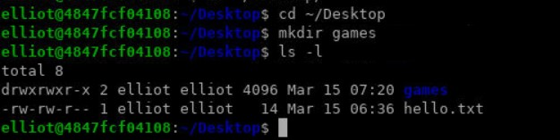


You can also create multiple directories at the same time. For example,
you can create three directories -- [Music], [Movies], and
[Books] -- on your desktop by running the [mkdir Music Movies
Books] command:

``` 
elliot@ubuntu-linux:~/Desktop$ mkdir Music Movies Books 
elliot@ubuntu-linux:~/Desktop$ ls -l
total 20
drwxr-xr-x 2 elliot elliot 4096 Jan 21 01:54 Books
drwxr-xr-x 2 elliot elliot 4096 Jan 20 20:20 games
-rw-r--r-- 1 elliot elliot   37 Jan 19 14:20 hello.txt
drwxr-xr-x 2 elliot elliot 4096 Jan 21 01:54 Movies
drwxr-xr-x 2 elliot elliot 4096 Jan 21 01:54 Music
```


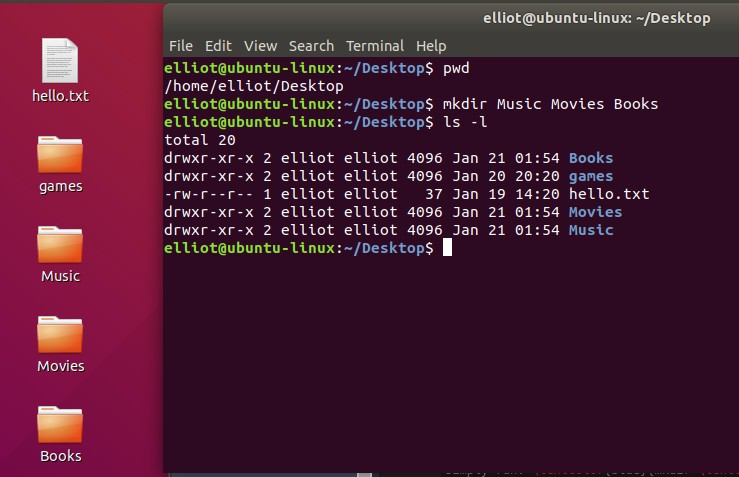


You can also use the [-p] option to create a whole path of
directories. For example, you can create the path
[/home/elliot/dir1/dir2/dir3] by running the [mkdir -p
dir1/dir2/dir3] command:

``` 
elliot@ubuntu-linux:~$ pwd
/home/elliot
elliot@ubuntu-linux:~$ mkdir -p dir1/dir2/dir3 
elliot@ubuntu-linux:~$ ls 
blabla Desktop dir1 
elliot@ubuntu-linux:~$ cd dir1 
elliot@ubuntu-linux:~/dir1$ ls 
dir2
elliot@ubuntu-linux:~/dir1$ cd dir2 
elliot@ubuntu-linux:~/dir1/dir2$ ls 
dir3
elliot@ubuntu-linux:~/dir1/dir2$ cd dir3 
elliot@ubuntu-linux:~/dir1/dir2/dir3$ pwd
/home/elliot/dir1/dir2/dir3 
elliot@ubuntu-linux:~/dir1/dir2/dir3$
```

It created [dir1] in the [/home/elliot] directory, and then
it created [dir2] inside of [dir1], and finally, it created
[dir3] inside of [dir2].

You can use the recursive [-R] option to do a recursive listing on
[/home/elliot/dir1] and see all the files underneath
[/home/elliot/dir1] without the hassle of changing to each
directory:

``` 
elliot@ubuntu-linux:~$ ls -R dir1 
dir1:
dir2

dir1/dir2:
dir3

dir1/dir2/dir3: 
elliot@ubuntu-linux:~$
```

As you can see, it listed all the files under [/home/elliot/dir1].
It even displayed the hierarchy.

You can also create a new directory with multiple subdirectories by
including them inside a pair of curly brackets and each subdirectory
separated by a comma like in the following:

``` 
elliot@ubuntu-linux:~/dir1/dir2/dir3$ mkdir -p dir4/{dir5,dir6,dir7} 
elliot@ubuntu-linux:~/dir1/dir2/dir3$ ls -R dir4
dir4:
dir5 dir6 dir7 

dir4/dir5: 

dir4/dir6:
 
dir4/dir7:
```

As you can see, we created [dir4], and inside it, we created three
directories -- [dir5], [dir6], and [dir7].


Combining command options
=========================


You have learned a lot of different options that you can use with the
[ls] command. Following table summarizes all the options we have
used so far.

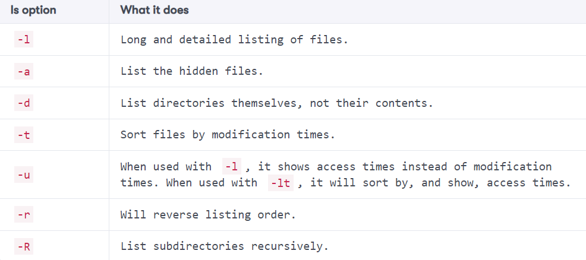

You will often be wanting to use two or more command options at a time.
For example, [ls -a -l] is commonly used to do a long listing for
all the files in a directory.

Also, [ls -l -a -t -r] is a very popular combination because
sometimes you would want to see the listing of the files sorted by
modification times (oldest first). For that reason, combining the
command options is more efficient and so running the [ls -latr]
command:

``` 
elliot@ubuntu-linux:~$ ls -latr 
total 120
-rw-r--r--  1 elliot elliot       0    Apr 11  2010 file2
-rw-r--r--  1 elliot elliot     807    Dec 26 23:47 .profile
-rw-r--r--  1 elliot elliot    3771    Dec 26 23:47 .bashrc
drwxr-xr-x  9 root   root      4096    Jan 17 04:37 ..
-rw-r--r--  1 elliot elliot     220    Jan 20 17:23 .bash_logout
drwxr-xr-x  6 elliot elliot    4096    Jan 25 22:13 Desktop
-rw-r--r--  1 elliot elliot       0    Jan 25 23:08 file1
-rw-r--r--  1 elliot elliot       0    Jan 25 23:27 file3
drwxr-xr-x  3 elliot elliot    4096    Jan 25 23:52 dir1
-rw-------  1 elliot elliot    3152    Jan 26 00:01 .bash_history
drwxr-xr-x 17 elliot elliot    4096    Jan 30 23:32 .
```

Will yield the same result as running the [ls -l -a -t -r]
command:

``` 
elliot@ubuntu-linux:~$ ls -l -a -t -r 
total 120
-rw-r--r--  1 elliot elliot    0 Apr 11  2010 file2
-rw-r--r--  1 elliot elliot  807 Dec 26 23:47 .profile
-rw-r--r--  1 elliot elliot 3771 Dec 26 23:47 .bashrc
drwxr-xr-x  9 root   root   4096 Jan 17 04:37 ..
-rw-r--r--  1 elliot elliot  220 Jan 20 17:23 .bash_logout
drwxr-xr-x  6 elliot elliot 4096 Jan 25 22:13 Desktop
-rw-r--r--  1 elliot elliot    0 Jan 25 23:08 file1
-rw-r--r--  1 elliot elliot    0 Jan 25 23:27 file3
drwxr-xr-x  3 elliot elliot 4096 Jan 25 23:52 dir1
-rw-------  1 elliot elliot 3152 Jan 26 00:01 .bash_history
drwxr-xr-x 17 elliot elliot 4096 Jan 30 23:32 .
```

Before this lab comes to an end, I want to show you a pretty cool
tip. First, let\'s create a directory named
[averylongdirectoryname]:

``` 
elliot@ubuntu-linux:~$ mkdir averylongdirectoryname 
elliot@ubuntu-linux:~$ ls -ld averylongdirectoryname
drwxr-xr-x 2 elliot elliot 4096 Mar 2 12:57 averylongdirectoryname
```

**Tab Completion** is one of the most useful features in the Linux
command line. You can use this to feature to let the shell automatically
complete (suggest) command names and file paths. To demonstrate, type
(don\'t run) the following text on your terminal:

``` 
elliot@ubuntu-linux:~$ cd ave
```

Now press the *Tab* key on your keyboard, and the shell will
automatically complete the directory name for you:

``` 
elliot@ubuntu-linux:~$ cd averylongdirectoryname/
```

Pretty cool! Alright, this takes us to the end of this lab, and
it\'s time for you to do the lovely knowledge check.


Knowledge check
===============


For the following exercises, open up your terminal and try to solve the
following tasks:

1.  Do a long listing for all the files in [/var/log].
2.  Display the contents of the file [/etc/hostname].
3.  Create three files -- [file1], [file2], and
    [file3] -- in [/home/elliot].
4.  List all the files (including hidden files) of [elliot]\'s
    home directory.
5.  Create a directory named [fsociety] in [/home/elliot].

True or false
-------------

1.  [/home/root] is the home directory of the root user.
2.  [dir1/dir2/dir3] is an example of an absolute path.
3.  [/home/elliot/Desktop] is an example of an absolute path.
4.  [touch -m file1] will update [file1] access time.
5.  [mkdir dir1 dir2 dir3] will create three directories --
    [dir1], [dir2], and [dir3].
