Lab: Linux File Editors
-----------------------


**Graphical editors -- gedit and kate**

We start with the most basic and simple editors out there.

**Note:** Make sure to run following command in the terminal first as root user:

`xhost +`

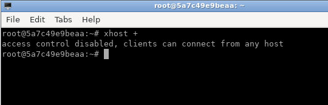

If you want to view a
text file with [gedit], then you run the [gedit] command
followed by any filename:

``` 
elliot@ubuntu-linux:~$ export DISPLAY=:1.0
elliot@ubuntu-linux:~$ gedit /proc/cpuinfo
```

This will open the [gedit] graphical editor, and it displays your
CPU information.


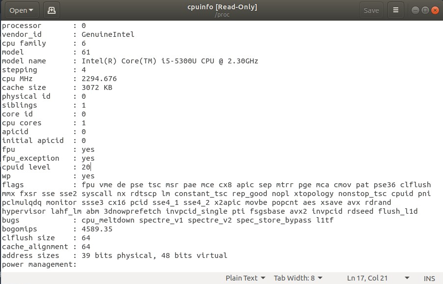


If you want to view a
text file with [kate], then you run the [kate] command
followed by any filename:

``` 
elliot@ubuntu-linux:~$ kate /proc/cpuinfo
```


You can also use the graphical editors to create new files on your
system. For example, if you want to create a file named [cats.txt]
in [/home/elliot], then you can run the [gedit
/home/elliot/cats.txt] command:

``` 
elliot@ubuntu-linux:~$ gedit /home/elliot/cats.txt
```


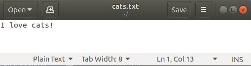


Now insert the line \"I love cats!\" then save and close the file. The
file [cats.txt] now exists in my home directory, and I can view it
with the [cat] command:

``` 
elliot@ubuntu-linux:~$ pwd
/home/elliot
elliot@ubuntu-linux:~$ ls -l cats.txt
-rw-r--r-- 1 elliot elliot 13 Feb 2 14:54 cats.txt 
elliot@ubuntu-linux:~$ cat cats.txt
I love cats!
```

Similarly, you can use any other graphical text editor to create files
on your system.

OK! That\'s enough talk about graphical text editors. Let\'s move on to
explore the serious world of non-graphical text editors.


The nano editor
===============


The [nano] editor is a very popular and easy-to-use command-line
editor. You can open the [nano] editor by running the [nano]
command:

``` 
elliot@ubuntu-linux:~$ nano
```

This will open up your [nano] editor, and you should see a screen
like that in the following screenshot:


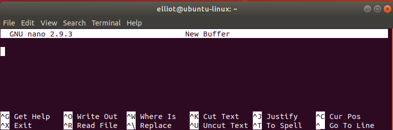


Now add the six lines that are shown in the following screenshot:

```
Apples are blue.
Grapes are green.
Bananas are yellow.
Roses are red.
Sky is high.
Earth is flat.
```

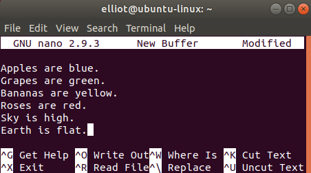


Look at the bottom of the [nano] editor screen; you will see a lot
of shortcuts:


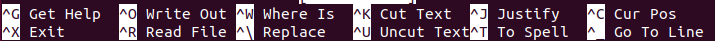


I have included all the useful nano shortcuts in the following table:

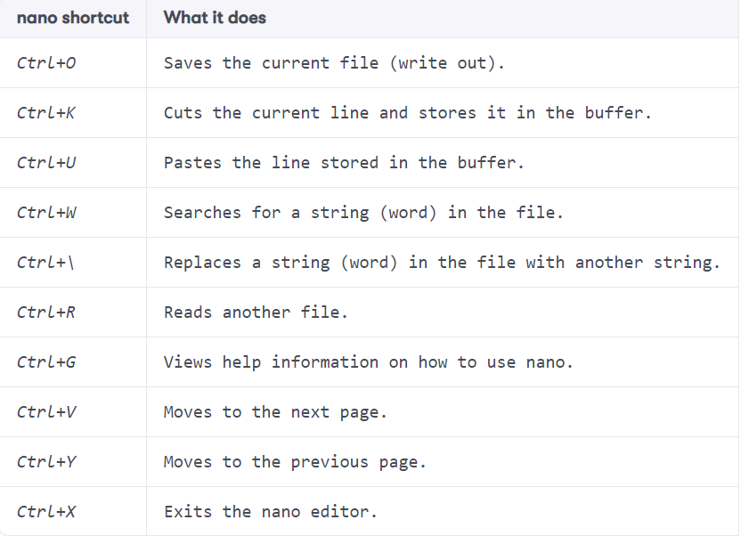


Notice that the *Ctrl*+*O* shortcut is triggered by pressing *Ctrl* and
then the letter *O*. You don\'t have to press the *+* key or the upper
case letter *O*.

Now let\'s use the shortcut *Ctrl*+*O* to save the file; it will ask you
for a filename, you can insert [facts.txt]:


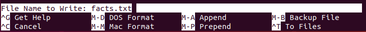


Then press *Enter* to confirm. Now let\'s exit the [nano] editor
(use the *Ctrl*+*X* shortcut) to verify that the file [facts.txt]
is created:

``` 
elliot@ubuntu-linux:~$ ls -l facts.txt
-rw-r--r-- 1 elliot elliot 98 Apr 30 15:17 facts.txt
```

Now let\'s open [facts.txt] again to fix the false facts we have
added there! To open the file [facts.txt] with the [nano]
editor, you can run the [nano facts.txt] command:

``` 
elliot@ubuntu-linux:~$ nano facts.txt
```

The first line in the file [facts.txt] states that \"Apples are
blue.\" We certainly need to correct this false fact, so let\'s use the
shortcut *Ctrl*+*\\* to replace the word [blue] with [red].

When you press *Ctrl*+*\\*, it will ask you to enter the word that you
want to replace; you can enter [blue], as shown in the following
screenshot:


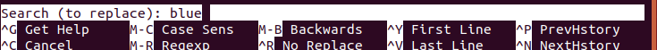


Hit *Enter*, and then it will ask you to enter the substitute word. You
can enter [red], as shown in the following screenshot:


You can then hit *Enter*, and it will go through each instance of the
word [blue] and ask you if you want to replace it. Luckily, we
only have one occurrence of [blue].


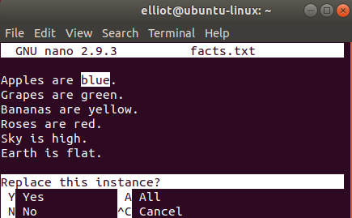


Press *Y* and BOOM! The word [red] replaced [blue].


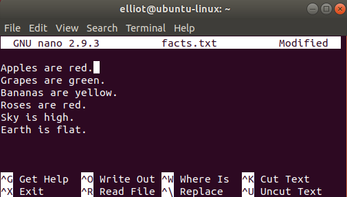


There is one more word we need to change here. We can all agree that the
Earth is not flat, right? I hope we all do! Now let\'s replace the word
[flat] with [round] precisely as we did before, and the
result should be like the one shown in the following screenshot:


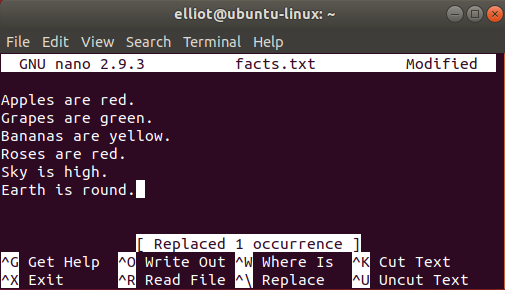


Now let\'s save and exit the file. So we use the *Ctrl*+*O* shortcut to
save and then *Ctrl*+*X* to exit.

The [nano] editor is pretty simple to use. And practice makes
perfect, so the more you use it, the easier it will become for you.

The vi editor
=============


The [nano] editor is usually the editor of choice for beginners.
It is a great editor, but let\'s just say that it\'s not the most
efficient editor out there. The [vi] editor is a more advanced
Linux editor with tons of features and is by far the most popular editor
among advanced Linux users.

Let\'s open the [facts.txt] file with the [vi] editor; to do
that, you run the [vi facts.txt] command:

``` 
elliot@ubuntu-linux:~$ vi facts.txt
```

This will open the [vi] editor, as shown in the following
screenshot:


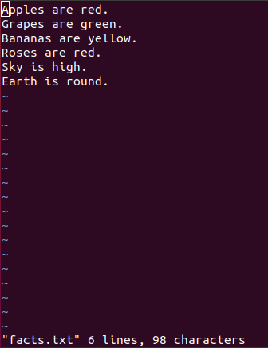


Unlike the [nano] editor, the [vi] editor works in two
different modes:

1.  [insert] mode
2.  [command] mode

The [insert] mode enables you to insert text into a file. On the
other hand, the [command] mode allows you to do things like
copying, pasting, and deleting text. The [command] mode also
allows you to search and replace text along with many other things.

Insert mode
-----------

By default, you enter [command] mode when you first open the
[vi] editor, and you can\'t insert text while you are in
[command] mode. To insert text, you need to switch to
[insert] mode. There are several ways you can use to change to
[insert] mode;


You can navigate in the [vi] editor with your arrow keys, just
like you would do in the [nano] editor. Now navigate to the last
line in the file [facts.txt] and then press the letter [o]
to switch into [insert] mode. You can now add the line \"Linux is
cool!\"


With [insert] mode, you can add as much text as you want. To
switch back to [command] mode, you need to press the *Esc* key.


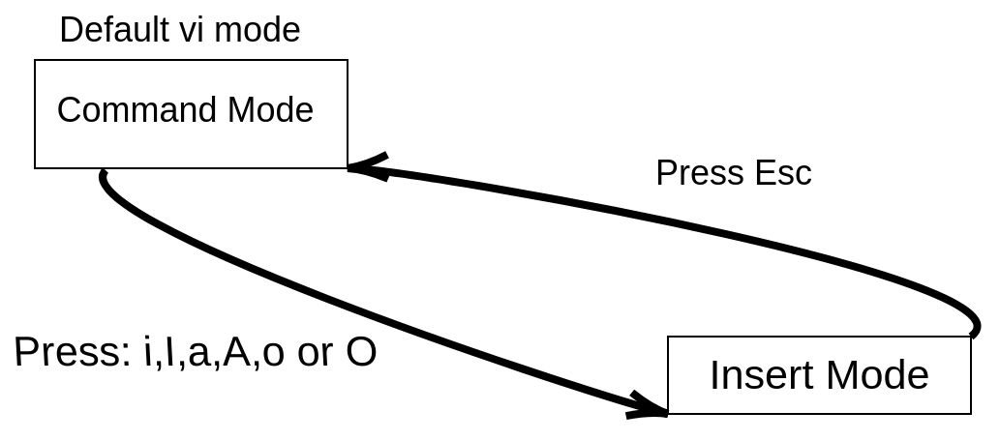

The preceding screenshot illustrates how to switch back and forth
between [command] mode and [insert] mode.

Command mode
------------

Anything you want to do aside from adding text can be achieved from
[command] mode. There are a whole lot of commands you can use with
the [vi] editor. You may think I am joking, but there are books
and courses out there that only discuss the [vi] editor. However,
below table will get you up and running with the [vi] editor as it
lists the most popular commands you can use with [vi].

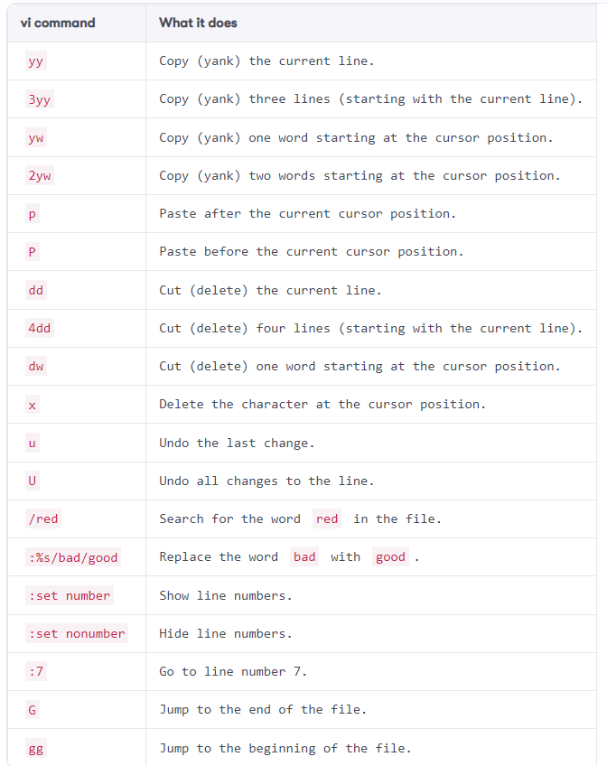

As you can see, above table has a lot of commands, so I will not go
through all of them; that\'s left for you as an exercise. However, I
will discuss some of the commands to help you get going with the
[vi] editor.

Let\'s start by showing line numbers as it will make our life much
easier! To do that, you run the [:set] number command, as shown in
the following screenshot:


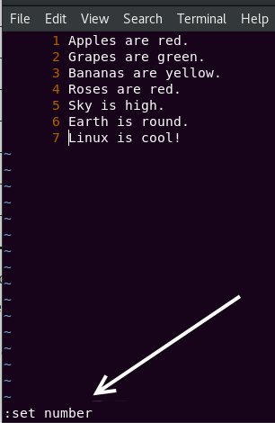


Now let\'s copy line [4]. You want to make sure the cursor is on
line [4]; you can do that by running the [:4] command, as
shown in the following screenshot:


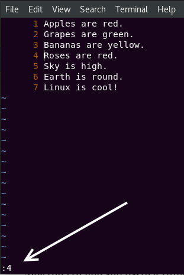


Now press the sequence [yy], and it will copy the entire line.
Let\'s paste it three times at the end of the file. So navigate to the
last line and then press *p* three times, it will paste the copied line
three times, as shown in the following screenshot:


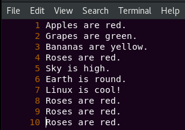


Alright! Let\'s replace the word [cool] with [awesome]
because we all know Linux is not just cool; it\'s awesome! To do that,
you run the [:%s/cool/awesome] command, as shown in the following
screenshot:


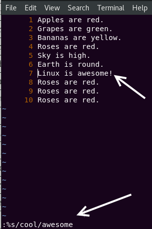


Let\'s also replace the word [Roses] with [Cherries] because
we all know that not all roses are red. To do that, run the
[:%s/Roses/Cherries] command, as shown in the following
screenshot:


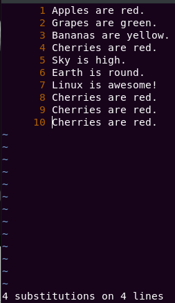


It will even tell you how many substitutions took place.


**COOL TIP**

You should know that [:%s/old/new] will only replace the first
occurrence of the word [old] with [new] on all the lines. To
replace all the occurrences of the word [old] with [new] on
all the lines, you should use the global option [:%s/old/new/g]


To understand and make sense of the tip above, add the line \"blue blue
blue blue\" to your [facts.txt] file and try to use the
[:%s/blue/purple] command to replace the word [blue] with
[purple]. You will see that it will only replace the first
occurrence of [blue]. To make it replace all occurrences of
[blue], you have to use the global option\
[:%s/blue/purple/g].

Saving and exiting vi
---------------------

Eventually, when you are done viewing or editing a file in [vi],
you would want to exit the [vi] editor. There are multiple ways
you can use to exit the [vi] editor, Below table lists all of
them.

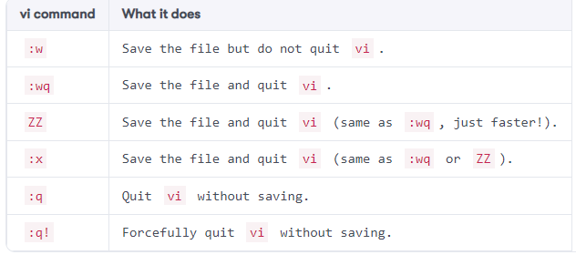


So let\'s save our file and quit the [vi] editor. Of course, you
can use any of the following commands:

1.  [:wq]
2.  [:x]
3.  [ZZ]

They all achieve the same result, that is, saving and exiting
[vi].


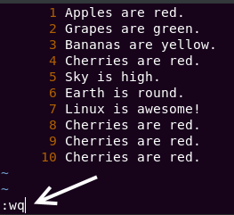


If you have successfully exited the [vi] editor, I want to
congratulate you because you are one of the elite. There are hundreds of
memes and comics on the internet about how some people opened the
[vi] editor, and were never able to exit!


File viewing commands
=====================


In some cases, you may just want to view a file without editing it.
While you can still use text editors like [nano] or [vi] to
view files, there are much faster ways to view a file in Linux.

The cat command
---------------

The [cat] command is one of the most popular and frequently used
commands in Linux. The [cat] (short for **concatenate**) command
concatenates and prints files to the standard output (terminal).

To view the [facts.txt] file that we created, you can run the [cat
facts.txt] command:

``` 
elliot@ubuntu-linux:~$ cat facts.txt 
Apples are red.
Grapes are green.
Bananas are yellow.
Cherries are red.
Sky is high.
Earth is round.
Linux is awesome!
Cherries are red.
Cherries are red.
Cherries are red.
```

You can now view the contents of the file [facts.txt] from the
comfort of your terminal without having to open any text editor.

**Task**

The [cat] command can do more than just viewing a file. It can
also concatenate (put together) files. To demonstrate, create the
following three files with your favorite text editor:

1.  [file1.txt] (Insert the line \"First File\")
2.  [file2.txt] (Insert the line \"Second File\")
3.  [file3.txt] (Insert the line \"Third File\")

Now let\'s view each of the three files using the [cat] command:

``` 
elliot@ubuntu-linux:~$ cat file1.txt 
First File
elliot@ubuntu-linux:~$ cat file2.txt 
Second File
elliot@ubuntu-linux:~$ cat file3.txt 
Third File
```

Now let\'s concatenate both [file1.txt] and [file2.txt]
together by running the [cat file1.txt file2.txt] command:

``` 
elliot@ubuntu-linux:~$ cat file1.txt file2.txt 
First File
Second File
```

We can also concatenate all three files:

``` 
elliot@ubuntu-linux:~$ cat file1.txt file2.txt file3.txt 
First File
Second File 
Third File
```

Keep in mind that order matters; for example, running the [cat file2.txt
file1.txt] command:

``` 
elliot@ubuntu-linux:~$ cat file2.txt file1.txt 
Second File
First File
```

This will output the text in [file2.txt] first before
[file1.txt].

The tac command
---------------

The [tac] command is the twin brother of the [cat] command.
It is basically [cat] written in reverse, and it does the same
thing as the [cat] command but in a reversed fashion!

For example, if you want to view the [facts.txt] file in reverse
order, you can run the [tac facts.txt] command:

``` 
elliot@ubuntu-linux:~$ tac facts.txt 
Cherries are red.
Cherries are red.
Cherries are red.
Linux is awesome!
Earth is round.
Sky is high.
Cherries are red.
Bananas are yellow.
Grapes are green.
Apples are red.
```

The [tac] command also concatenates files, just like the
[cat] command.

The more command
----------------

Let\'s view the contents of the file [/etc/services] with the
[more] command:

``` 
elliot@ubuntu-linux:~$ more /etc/services 
# Network services, Internet style
# Note that it is presently the policy of IANA to assign a single well-known 
# port number for both TCP and UDP; hence, officially ports have two entries 
# even if the protocol doesn't support UDP operations.

tcpmux 1/tcp # TCP port service multiplexer 
systat 11/tcp users
netstat 15/tcp ftp 21/tcp
fsp 21/udp fspd
ssh 22/tcp # SSH Remote Login Protocol 
telnet 23/tcp
smtp 25/tcp mail 
whois 43/tcp nicname
tacacs 49/tcp # Login Host Protocol (TACACS) 
tacacs 49/udp
--More--(7%)
```

It will show you the first page of the [/etc/services] files, and
there is a percentage value at the bottom line that shows how far you
have progressed through the file. You can use the following keys to
navigate in [more]:

-   *Enter* \> to scroll down one line.
-   Space Bar \> to go to the next page.
-   *b* \> to go back one page.
-   *q* \> to quit.

The [/etc/services] file stores information on numerous services
(applications) that can run on Linux.

The less command
----------------

You can view the [/etc/services] file with [less] by running
the command:

``` 
elliot@ubuntu-linux:~$ less /etc/services
```

You can also use [more] navigation keys with less.

Heads or tails?
---------------

As its name suggests, the [head] command displays the first few
lines of a file. By default, it shows the first ten lines of a file. For
example, we know that [facts.txt] has ten lines in it, and so
running the [head facts.txt] command will display all the file
contents:

``` 
elliot@ubuntu-linux:~$ head facts.txt 
Apples are red.
Grapes are green.
Bananas are yellow.
Cherries are red.
Sky is high.
Earth is round.
Linux is awesome!
Cherries are red.
Cherries are red.
Cherries are red.
```

You can also pass the [-n] option to specify the number of lines
you wish to view. For example, to display the first three lines of
[facts.txt], you can run the [head -n 3 facts.txt] command:

``` 
elliot@ubuntu-linux:~$ head -n 3 facts.txt 
Apples are red.
Grapes are green.
Bananas are yellow.
```

On the other hand, the [tail] command displays the last few lines
of a file. By default, it shows the last ten lines. You can also use the
[-n] option to specify the number of lines you wish to view. For
example, to display the last two lines in [facts.txt], you can run
the [tail -n 2 facts.txt] command:

``` 
elliot@ubuntu-linux:~$ tail -n 2 facts.txt 
Cherries are red.
Cherries are red.
```

Do you know what time it is? It\'s time for some knowledge check
questions.


Knowledge check
===============


For the following exercises, open up your Terminal and try to solve the
following tasks:

1.  Only view the first two lines of the file [facts.txt].
2.  Only view the last line of the file [facts.txt].
3.  Display the contents of the file [facts.txt] in a reversed
    order.
4.  Open the file [facts.txt] using the [vi] editor.
5.  Exit the [vi] editor and consider yourself one of the elites.
