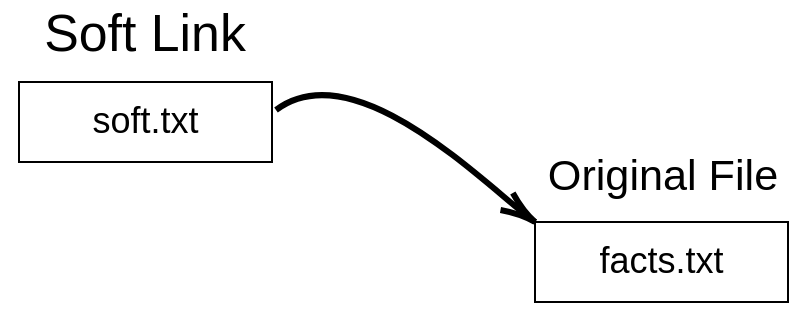
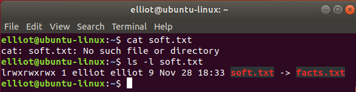
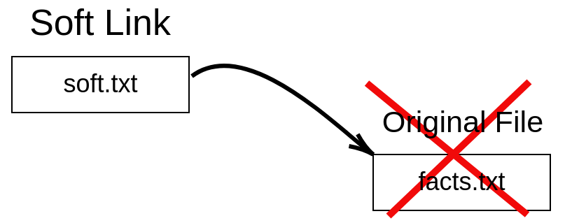
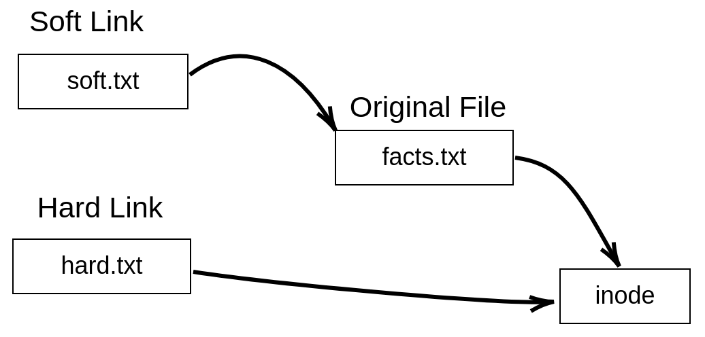
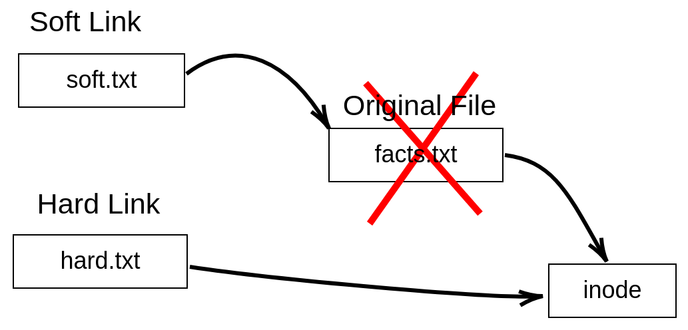

Lab: Hard versus Soft Links
===========================

In this lab, we further our knowledge on Linux files, and we discuss
the differences between hard and soft links. If you have ever created a
shortcut in Windows (or macOS) before, you will quickly grasp the
concept of a soft link. But before we discuss hard and soft links, you
first have to understand the concept of an inode.


Displaying file inode number
============================


There are two commands you can use to view the inode number of a file:

1.  [ls -i] file
2.  [stat] file

For example, to view the inode number of [facts.txt], you can run
the command [ls -i facts.txt]:

``` 
elliot@ubuntu-linux:~$ ls -i facts.txt 
924555 facts.txt
```

And it will spit out the inode number for you. You can also use the
[stat] command:

``` 
elliot@ubuntu-linux:~$ stat facts.txt 
File: facts.txt
Size: 173 Blocks: 8 IO Block: 4096 regular file
Device: 801h/2049d Inode: 924555 Links: 1
Access: (0644/-rw-r--r--) Uid: ( 1000/ tom) Gid: ( 1000/ tom) 
Access: 2019-05-08 13:41:16.544000000 -0600
Modify: 2019-05-08 12:50:44.112000000 -0600
Change: 2019-05-08 12:50:44.112000000 -0600
Birth: -
```

The [stat] command doesn\'t just list the inode number of a file;
it also lists all the file attributes as you can see from the command
output.


Creating soft links
===================


Now since you understand what a file inode is, you can easily understand
the concept of hard and soft links. And let us start with soft links:


**WHAT IS A SOFT LINK?**

A soft link (also referred to as a symbolic link) is simply a file that
points to another file.


A picture is worth a thousand words, so the following diagram will help
you visualize soft links.





To create a soft link, we use the [ln] command with the [-s]
option as follows:

``` 
ln -s original_file soft_link
```

So to create a soft link named [soft.txt] to the [facts.txt]
file, you can run the command [ln -s facts.txt soft.txt]:

``` 
elliot@ubuntu-linux:~$ ln -s facts.txt soft.txt
```

Now let\'s do a long listing on the soft link file [soft.txt] that
we just created:

``` 
elliot@ubuntu-linux:~$ ls -l soft.txt
lrwxrwxrwx 1 tom tom 9 May 8 21:48 soft.txt -> facts.txt
```

You will notice two things. First, the letter [l] in the first
column of the output [lrwxrwxrwx], which signals that the file is
a link (soft link), and secondly you can see the right arrow [soft.txt →
facts.txt], which basically tells us that [soft.txt] is a
soft link that points to the file [facts.txt].

Now let\'s check the contents of the file [soft.txt]:

``` 
elliot@ubuntu-linux:~$ cat soft.txt 
Apples are red.
Grapes are green.
Bananas are yellow.
Cherries are red.
Sky is high.
Earth is round.
Linux is awesome!
Cherries are red.
Cherries are red.
Cherries are red.
```

Of course, it contains the same data that the original file
[facts.txt] has. In fact, if you edit the soft link, it will
actually edit the original file as well.

To demonstrate, open the file [soft.txt] with any text editor and
add the line \"Grass is green.\" at the very end of the file, and then
save and exit so the contents of [soft.txt] will be as follows:

``` 
elliot@ubuntu-linux:~$ cat soft.txt 
Apples are red.
Grapes are green.
Bananas are yellow.
Cherries are red.
Sky is high.
Earth is round.
Linux is awesome!
Cherries are red.
Cherries are red.
Cherries are red.
Grass is green.
```

Now let\'s check the contents of the original file [facts.txt]:

``` 
elliot@ubuntu-linux:~$ cat facts.txt 
Apples are red.
Grapes are green.
Bananas are yellow.
Cherries are red.
Sky is high.
Earth is round.
Linux is awesome!
Cherries are red.
Cherries are red.
Cherries are red.
Grass is green.
```

As you can see, the new line \"Grass is green.\" is also there. That\'s
because every time you edit a soft link, it actually edits the original
file that it points to as well.

Now if you delete the soft link, nothing will happen to the original
file, it remains intact:

``` 
elliot@ubuntu-linux:~$ rm soft.txt 
elliot@ubuntu-linux:~$ cat facts.txt
Apples are red.
Grapes are green.
Bananas are yellow.
Cherries are red.
Sky is high.
Earth is round.
Linux is awesome!
Cherries are red.
Cherries are red.
Cherries are red.
Grass is green.
```

Now let\'s create the soft link [soft.txt] again:

``` 
elliot@ubuntu-linux:~$ ln -s facts.txt soft.txt
```

If you delete the original file [facts.txt], the soft link
[soft.txt] will become useless! But before we delete the
[facts.txt] file, let\'s make a copy of it in [/tmp] because
we will need it later on:

``` 
elliot@ubuntu-linux:~$ cp facts.txt /tmp
```

Now let\'s delete the file [facts.txt] from [elliot]\'s home
directory and see what happens to the soft link:

``` 
elliot@ubuntu-linux:~$ rm facts.txt 
elliot@ubuntu-linux:~$ cat soft.txt 
cat: soft.txt: No such file or directory
```

As you can see, the soft link [soft.txt] becomes useless as it\'s
now pointing to nowhere. Keep in mind that the file [soft.txt]
still exists, as shown in the following screenshot.





The following diagram shows you that the soft link [soft.txt]
points to nowhere after the original file [facts.txt] has been
deleted.





Now if we moved [facts.txt] back to [elliot]\'s home
directory:

``` 
elliot@ubuntu-linux:~$ mv /tmp/facts.txt /home/elliot
```

The soft link [soft.txt] will be useful again! You can say that we
resurrected the soft link!

``` 
elliot@ubuntu-linux:~$ cat soft.txt 
Apples are red.
Grapes are green.
Bananas are yellow.
Cherries are red.
Sky is high.
Earth is round.
Linux is awesome!
Cherries are red.
Cherries are red.
Cherries are red.
Grass is green.
```

Let\'s compare the inode numbers of the soft link [soft.txt] and
the original file [facts.txt]:

``` 
elliot@ubuntu-linux:~$ ls -i soft.txt facts.txt 
925155 facts.txt 924556 soft.txt
```

As you can see, the inode numbers of the two files are different.
Finally, let\'s run the [stat] command on the soft link
[soft.txt]:

``` 
elliot@ubuntu-linux:~$ stat soft.txt 
File: soft.txt -> facts.txt
Size: 9 Blocks: 0 IO Block: 4096 symbolic link
Device: 801h/2049d Inode: 924556 Links: 1
Access: (0777/lrwxrwxrwx) Uid: ( 1000/ tom) Gid: ( 1000/ tom) 
Access: 2019-05-08 22:04:58.636000000 -0600
Modify: 2019-05-08 22:02:18.356000000 -0600
Change: 2019-05-08 22:02:18.356000000 -0600
Birth: -
```

As you can see, it lists the file as a symbolic link, which is another
name for a soft link.

So as you have seen so far, a soft link has the following properties:

-   The inode of a soft link is different from the original file.
-   A soft link becomes useless once the original file is deleted.
-   Any change to the soft link is actually a change in the original
    file.
-   You can create soft links to directories.

You can create soft links to directories the same way you can create
soft links to files. To demonstrate, let\'s first create a directory
named [sports] in [elliot]\'s home directory. And inside
[sports], create three files -- [swimming], [soccer],
and [hockey] -- as follows:

``` 
elliot@ubuntu-linux:~$ mkdir sports
elliot@ubuntu-linux:~$ touch sports/swimming sports/soccer sports/hockey 
elliot@ubuntu-linux:~$ ls sports
hockey soccer swimming
```

Now let\'s create a soft link named [softdir1] to the
[sports] directory:

``` 
elliot@ubuntu-linux:~$ ln -s sports softdir1
```

Now if you change to [softdir1], you are actually changing to
[sports], and so you will see the same directory contents:

``` 
elliot@ubuntu-linux:~$ cd softdir1 
elliot@ubuntu-linux:~/softdir1$ ls 
hockey soccer swimming
```

Of course, the same thing holds for directories as well; that is, if you
delete the original directory, the soft link will become useless!


Creating hard links
===================


The story is a little bit different when it comes to hard links. That\'s
because a hard link is a replica of the original file. And here is a
definition of a hard link:

The following diagram helps you visualize hard links:





We use the same [ln] command to create hard links, but this time
we omit the [-s] option:

``` 
ln original_file hard_link
```

So to create a hard link named [hard.txt] to the file
[facts.txt], you can simply run the command [ln facts.txt
hard.txt]:

``` 
elliot@ubuntu-linux:~$ cd ~
elliot@ubuntu-linux:~$ ln facts.txt hard.txt
```

Now let\'s do a long listing on the hard link [hard.txt] and the
original file [facts.txt]:

``` 
elliot@ubuntu-linux:~$ ls -l hard.txt
-rw-rw-r-- 2 tom tom 210 May 9 00:07 hard.txt 
elliot@ubuntu-linux:~$ ls -l facts.txt
-rw-rw-r-- 2 tom tom 210 May 9 00:07 facts.txt
```

They are identical! The hard link also has the same contents just like
the original file:

``` 
elliot@ubuntu-linux:~$ cat hard.txt 
Apples are red.
Grapes are green.
Bananas are yellow.
Cherries are red.
Sky is high.
Earth is round.
Linux is awesome!
Cherries are red.
Cherries are red.
Cherries are red.
Grass is green.
```

Now add the line \"Swimming is a sport.\" to the very end of the hard
link [hard.txt] with the text editor of your choice:

``` 
elliot@ubuntu-linux:~$ cat hard.txt 
Apples are red.
Grapes are green.
Bananas are yellow.
Cherries are red.
Sky is high.
Earth is round.
Linux is awesome!
Cherries are red.
Cherries are red.
Cherries are red.
Grass is green.
Swimming is a sport.
```

Now just like in the case with soft links, the content of the original
file has also changed:

``` 
elliot@ubuntu-linux:~$ cat facts.txt 
Apples are red.
Grapes are green.
Bananas are yellow.
Cherries are red.
Sky is high.
Earth is round.
Linux is awesome!
Cherries are red.
Cherries are red.
Cherries are red.
Grass is green.
Swimming is a sport.
```

Now let\'s check the inode numbers of both files:

``` 
elliot@ubuntu-linux:~ ls -i hard.txt facts.txt 
925155 facts.txt 925155 hard.txt
```

Notice that both files have the same inode number. Now let\'s run the
[stat] command on both files:

``` 
elliot@ubuntu-linux:~$ stat hard.txt facts.txt 
File: hard.txt
Size: 210 Blocks: 8 IO Block: 4096 regular file
Device: 801h/2049d Inode: 925155 Links: 2
Access: (0664/-rw-rw-r--) Uid: ( 1000/ elliot) Gid: ( 1000/ elliot) 
Access: 2019-05-09 00:07:36.884000000 -0600
Modify: 2019-05-09 00:07:25.708000000 -0600
Change: 2019-05-09 00:07:25.720000000 -0600
Birth: -
File: facts.txt
Size: 210 Blocks: 8 IO Block: 4096 regular file
Device: 801h/2049d Inode: 925155 Links: 2
Access: (0664/-rw-rw-r--) Uid: ( 1000/ elliot) Gid: ( 1000/ elliot)
Access: 2019-05-09 00:07:36.884000000 -0600
Modify: 2019-05-09 00:07:25.708000000 -0600
Change: 2019-05-09 00:07:25.720000000 -0600
Birth: -
```

The output of the [stat] command is identical for both files. And
also, the number of [Links: 2] here means that there are two hard
links to the file. Hmmm! We have only created one hard link to the file
[facts.txt], then how come it listed two hard links? Well, the
original file is a hard link to itself, and so any file has a minimum of
one hard link (itself).

Now unlike the case with soft links, if you delete the original file
[facts.txt]:

``` 
elliot@ubuntu-linux:~$ rm facts.txt
```

The hard link remains intact:

``` 
elliot@ubuntu-linux:~$ cat hard.txt 
Apples are red.
Grapes are green.
Bananas are yellow.
Cherries are red.
Sky is high.
Earth is round.
Linux is awesome!
Cherries are red.
Cherries are red.
Cherries are red.
Grass is green.
Swimming is a sport.
```

The following diagram shows you why the hard link remains intact.





Now notice that after the removal of the file [facts.txt], the
number of hard links count of the file [hard.txt] will decrease to
one:

``` 
elliot@ubuntu-linux:~$ stat hard.txt 
File: hard.txt
Size: 210 Blocks: 8 IO Block: 4096 regular file
Device: 801h/2049d Inode: 925155 Links: 1
Access: (0664/-rw-rw-r--) Uid: ( 1000/ elliot) Gid: ( 1000/ elliot) 
Access: 2019-05-09 00:17:21.176000000 -0600
Modify: 2019-05-09 00:07:25.708000000 -0600
Change: 2019-05-09 00:17:18.696000000 -0600
Birth: -
```

You can\'t create a hard link to a directory. If you don\'t believe me,
then try creating a hard link named [variables] to the
[/var] directory:

``` 
elliot@ubuntu-linux:~$ ln /var variables
ln: /var: hard link not allowed for directory
```


Knowledge check
===============


For the following exercises, open up your Terminal and try to solve the
following tasks:

1.  Display the inode number of the [/var/log] directory.
2.  Display the number of hard links for the [/boot] directory.
3.  Create a new directory named [coins] in your home directory.
4.  Create a soft link to [coins] named [currency].
5.  Inside the [coins] directory, create two files --
    [silver] and [gold].
6.  Create a new file [bronze] inside [currency].
7.  List the contents of both directories -- [coins] and
    [currency].
8.  Create a new file [beverages] with the line \"coffee is
    awesome\" in your home directory and create a hard link named
    [drinks] to [beverages].
9.  Add the line \"lemon is refreshing\" to the [drinks] file and
    then remove the [beverages] file.
10. Display the contents of your [drinks] file.

True or false
-------------

1.  The **File Name** is a part of the inode data structure.
2.  The **File Size** is a part of the inode data structure.
3.  You can create soft links to directories.
4.  You can create hard links to directories.
5.  The minimum number of hard links for a directory is [2].
6.  Soft links have the same inode number as the original file.
7.  Hard links have the same inode number as the original file.
