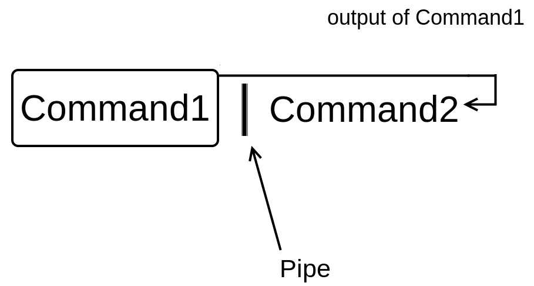
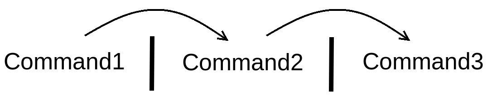

Lab: Piping and I/O Redirection
===============================


One of the main principles in Linux is that *Each program does one thing
well* and thus, every Linux command is designed to accomplish a single
task efficiently. In this lab, you will learn how to use Linux pipes
to unleash the real power of Linux commands by combining their
functionality to carry out more complex tasks. You will also learn about
I/O (input/output) redirection, which will enable you to read user input
and save command output to a file.


Linux pipes
===========


In Linux, you can use a pipe to send the output of one command to be the
input (argument) of another command:





Before we do an example, let\'s first rename the [hard.txt] file
to [facts.txt], as we removed the [facts.txt] file back in `Lab 6`,
*Hard vs. Soft Links*:

``` 
elliot@ubuntu-linux:~$ mv hard.txt facts.txt
```

Now let\'s use the [head] command to view the first five lines of
[facts.txt]:

``` 
elliot@ubuntu-linux:~$ head -n 5 facts.txt 
Apples are red.
Grapes are green.
Bananas are yellow.
Cherries are red.
Sky is high.
```

Now I want to display only the fifth line [Sky is high.] of the
file [facts.txt]; how can I do that?

That\'s where the power of Linux pipes comes into play. If you pipe the
output of the previous command to the [tail -n 1] command, you
will get the fifth line:

``` 
elliot@ubuntu-linux:~$ head -n 5 facts.txt | tail -n 1 
Sky is high.
```

So by using a pipe, I was able to send the output of the command [head
-n 5 facts.txt] to the input (argument) of the command [tail -n
1].

Let\'s do another example. If you want to display the seventh line of
the file [facts.txt], then you will show the first seven lines
using the [head] command, then use a pipe to [tail] the last
line:

``` 
elliot@ubuntu-linux:~$ head -n 7 facts.txt | tail -n 1 
Linux is awesome
```

You can also use more than one pipe at a time as demonstrated in the
following diagram:





For example, you already know that the [lscpu] command displays
your processor information. The fourth line of the [lscpu] command
output shows how many CPUs your machine has. You can display the fourth
line of the [lscpu] command by using two pipes:

``` 
elliot@ubuntu-linux:~$ lscpu | head -n 5 | tail -n 1 
CPU(s):       4
```

So let\'s break down what happened here. The first pipe we used was to
show the first four lines of the [lscpu] command:

``` 
elliot@ubuntu-linux:~$ lscpu | head -n 5 

Architecture:                    x86_64
CPU op-mode(s):                  32-bit, 64-bit
Byte Order:                      Little Endian
Address sizes:                   40 bits physical, 48 bits virtual
CPU(s):                          4
```

We then used the second pipe to [tail] the last line, which gets
us the fourth line in this case:

``` 
elliot@ubuntu-linux:~$ lscpu | head -n 5 | tail -n 1 
CPU(s):        4
```

You can similarly display the second line of [lscpu], which shows
your CPU operation modes, but I will leave that for you to do as an
exercise.


Input and output redirection
============================


In this section, you will get to learn one of the coolest Linux
features, which is I/O (input/output) redirection. Most Linux commands
work with three different streams of data:

-   Standard input (also referred to as [stdin])
-   Standard output (also referred to as [stdout])
-   Standard error (also referred to as [stderr])


Redirecting standard output
===========================


You know that running the [date] command will display the current
date on your terminal:

``` 
elliot@ubuntu-linux:~$ date 
Wed Mar 15 11:50:13 UTC 2023
```

Now by using the greater than sign [\>], you can redirect the
output of the [date] command to a file instead of your terminal!
Have a look:

``` 
elliot@ubuntu-linux:~$ date > mydate.txt
```

As you can see, there is no output displayed on your screen! That\'s
because the output got redirected to the file [mydate.txt]:

``` 
elliot@ubuntu-linux:~$ cat mydate.txt 
Sat May 11 06:04:49 CST 2019
```

Cool! Let\'s try some more examples. You can print a line on your
terminal with the [echo] command:

``` 
elliot@ubuntu-linux:~$ echo "Mars is a planet." 
Mars is a planet.
```

If you want to redirect the output to a file named [planets.txt],
you can run the command:

``` 
elliot@ubuntu-linux:~$ echo "Mars is a planet." > planets.txt 
elliot@ubuntu-linux:~$ cat planets.txt
Mars is a planet
```

Awesome! Notice that the file [planets.txt] was also created in
the process. Now let\'s add more planets to the file
[planets.txt]:

``` 
elliot@ubuntu-linux:~$ echo "Saturn is a planet." > planets.txt 
elliot@ubuntu-linux:~$ cat planets.txt
Saturn is a planet.
```

Hmmm. We added the line \"Saturn is a planet.\" but the line \"Mars is a
planet.\" is now removed! That\'s because redirecting standard output
with [\>] overwrites the file. What we need in this case is to
append to the file and this can be done by using a double greater than
sign [\>\>]. So now let\'s append the line \"Mars is a planet.\"
back to the file [planets.txt]:

``` 
elliot@ubuntu-linux:~$ echo "Mars is a planet." >> planets.txt 
elliot@ubuntu-linux:~$ cat planets.txt
Saturn is a planet.
Mars is a planet.
```

Great! As you can see, it added the line \"Mars is a planet.\" to the
end of the file. Let\'s append one more planet:

``` 
elliot@ubuntu-linux:~$ echo "Venus is a planet." >> planets.txt 
elliot@ubuntu-linux:~$ cat planets.txt
Saturn is a planet.
Mars is a planet.
Venus is a planet.
```

Awesome! One more thing you need to know here is that the standard
output ([stdout]) is linked to file descriptor 1.


**WHAT IS A FILE DESCRIPTOR?**

A file descriptor is a number that uniquely identifies an open file in a
computer\'s operating system.


And so running the command:

``` 
elliot@ubuntu-linux:~$ date > mydate.txt
```

Is the same as running the command:

``` 
elliot@ubuntu-linux:~$ date 1> mydate.txt
```

Notice that the [1] in [1\>] references file descriptor 1
([stdout]).


Redirecting standard error
==========================


You will get an error message if you try to display the contents of a
file that doesn\'t exist:

``` 
elliot@ubuntu-linux:~$ cat blabla 
cat: blabla: No such file or directory
```

Now, this error message comes from standard error ([stderr]). If
you try to redirect errors the same way we did with the standard output,
it will not work:

``` 
elliot@ubuntu-linux:~$ cat blabla > error.txt 
cat: blabla: No such file or directory
```

As you can see, it still displays the error message on your terminal.
That\'s because [stderr] is linked to file descriptor 2. And thus,
to redirect errors, you have to use [2\>]:

``` 
elliot@ubuntu-linux:~$ cat blabla 2> error.txt
```

Now if you displayed the contents of the file [error.txt], you
would see the error message:

``` 
elliot@ubuntu-linux:~$ cat error.txt 
cat: blabla: No such file or directory
```

Let\'s try to remove a file that doesn\'t exist:

``` 
elliot@ubuntu-linux:~$ rm brrrr
rm: cannot remove 'brrrr': No such file or directory
```

This also produces an error message. We can append this error message to
the file\
[error.txt] using [2\>\>]:

``` 
elliot@ubuntu-linux:~$ rm brrrr 2>> error.txt
```

Now if you display the contents of the file [error.txt]:

``` 
elliot@ubuntu-linux:~$ cat error.txt 
cat: blabla: No such file or directory
rm: cannot remove 'brrrr': No such file or directory
```

You will see both error messages.


Redirecting all output to the same file
=======================================


There are some situations where you can get both standard output and an
error message at the same time. For example, if you run the following
command:

``` 
elliot@ubuntu-linux:~$ cat planets.txt blabla 
Saturn is a planet.
Mars is a planet.
Venus is a planet.
cat: blabla: No such file or directory
```

You will see that it displayed the contents of the file
[planets.txt], but it also displayed an error message at the very
last line (because there is no file [blabla] to concatenate).

You can choose to redirect the error to another file:

``` 
elliot@ubuntu-linux:~$ cat planets.txt blabla 2> err.txt 
Saturn is a planet.
Mars is a planet.
Venus is a planet.
```

This way, you only see the standard output on the screen. Or you may
choose to redirect the standard output:

``` 
elliot@ubuntu-linux:~$ cat planets.txt blabla 1> output.txt 
cat: blabla: No such file or directory
```

This way, you only see the error on the screen. Now, what if you want to
redirect both the standard output and the error to the same file? In
this case, you have to run:

``` 
elliot@ubuntu-linux:~$ cat planets.txt blabla > all.txt 2>&1
```

[&1] is referencing the standard output while [2\>] is
referencing the standard error. So what we are basically saying here is:
\"Redirect the stderr to the same place we are redirecting the stdout.\"

Now if you displayed the contents of the file [all.txt]:

``` 
elliot@ubuntu-linux:~$ cat all.txt 
Saturn is a planet.
Mars is a planet.
Venus is a planet.
cat: blabla: No such file or directory
```

You can see it includes both the [stdout] and [stderr].


Discarding output
=================


Sometimes you don\'t need to redirect output to anywhere; you just want
to throw it away and get rid of it. In this case, you can redirect the
output to [/dev/null]. This is often used with error messages. For
example:

``` 
elliot@ubuntu-linux:~$ cat planets.txt blabla 2> /dev/null 
Saturn is a planet.
Mars is a planet.
Venus is a planet.
```

This will redirect the error message to [/dev/null]. You can think
of [/dev/null] as a garbage collector.


Redirecting standard input
==========================


Some Linux commands interact with the user input through the standard
input (which is your keyboard by default). For example, the [read]
command reads input from the user and stores it in a variable. For
example, you can run the command [read weather]:

``` 
elliot@ubuntu-linux:~$ read weather 
It is raining.
```

It will then wait for you to enter a line of text. I entered the line
[It is raining.] and so it stored the line in the [weather]
variable. You can use the [echo] command to display the contents
of a variable:

``` 
elliot@ubuntu-linux:~$ echo $weather 
It is raining.
```

Notice that you have to precede the variable name with a dollar sign.
The [read] command is particularly useful in shell scripts, which
we will cover later on. Now notice I wrote the line [It is
raining.] using my keyboard. However, I can redirect standard
input to come from a file instead using the less-than sign [\<],
for example:

``` 
elliot@ubuntu-linux:~$ read message < mydate.txt
```

This will read the contents of the file [mydate.txt] and store it
in the [message] variable:

``` 
elliot@ubuntu-linux:~$ echo $message 
Wed Mar 15 11:51:49 UTC 2023
```

As you can see, the variable [message] now has the same contents
as the file [my- date.txt].


Knowledge check
===============


For the following exercises, open up your terminal and try to solve the
following tasks:

1.  Display only the *5th* line of the file [facts.txt].
2.  Save the output of the [free] command into a file named
    [system.txt].
3.  Append the output of the [lscpu] command to the file
    [system.txt].
4.  Run the command [rmdir /var] and redirect the error message to
    the file [error.txt].
